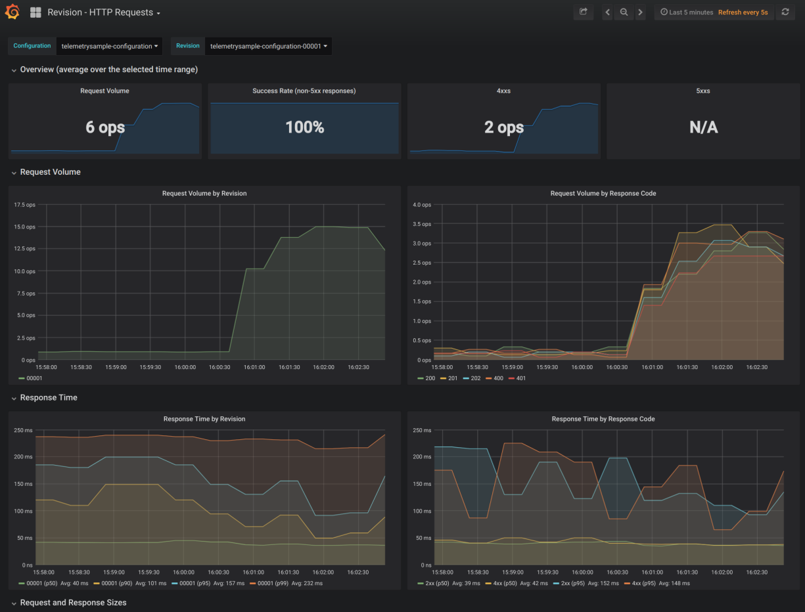

# Investigating Performance Issues

You deployed your application or function to Elafros but its performance 
is not up to the expectations. Elafros provides various dashboards and tools to 
help investigate such issues. This document goes through these dashboards
and tools.

## Request metrics

Open Grafana UI as described in [telemetry.md](../telemetry.md) and navigate
to "Elafros - Revision HTTP Requests" dashboard. Select your configuration and revision
from the menu on top left of the page. You will see a page like below:

In this dashboard, you can see:
* Request volume by revision -- explain
* Request latency by revision -- explain
* Request and response sizes -- explain
* Check and see if a particular revision is having an issue or all - explain
* WHAT ELSE?????* WHAT ELSE?????* WHAT ELSE?????* WHAT ELSE?????* WHAT ELSE?????

## End to end traces
* Explain

## Auto scaler metrics
- Desired pod count
- Requested pod count
- Actual pod count
- Panic mode
- Explain what happens in each different situation

## CPU metrics
see how much time is spent in your containers

## Pod metrics
needed?????

## Node metrics
needed?????

## Use a profiler???????
