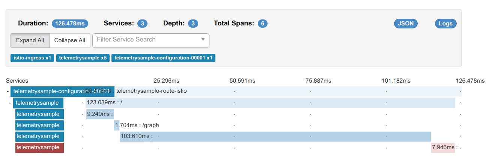
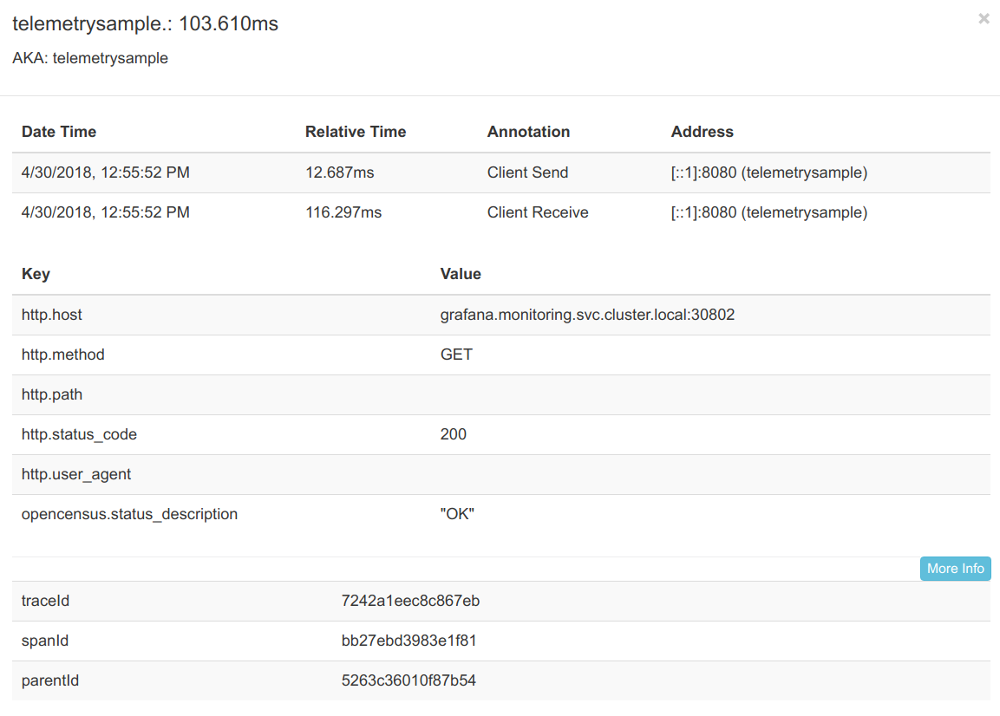
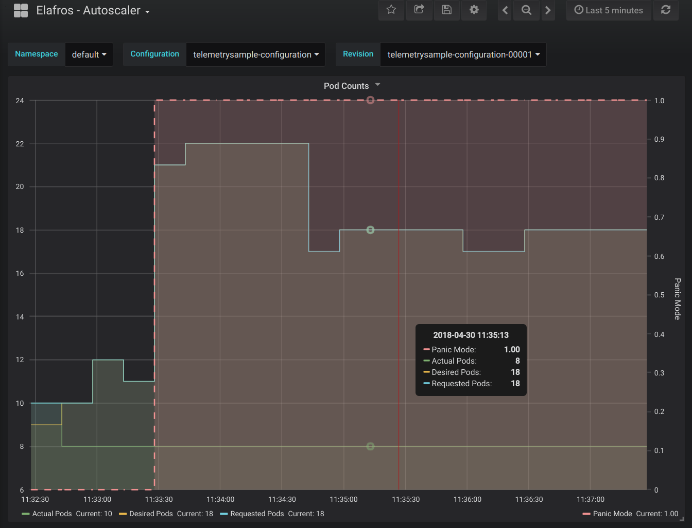
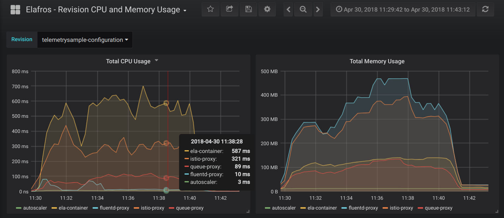

# Investigating Performance Issues

You deployed your application or function to Knative Serving but its performance
is not up to the expectations. Knative Serving provides various dashboards and tools to
help investigate such issues. This document goes through these dashboards
and tools.

## Request metrics

Start your investigation with "Revision - HTTP Requests" dashboard. To open this dashboard,
open Grafana UI as described in [telemetry.md](../telemetry.md) and navigate to
"Knative Serving - Revision HTTP Requests". Select your configuration and revision
from the menu on top left of the page. You will see a page like below:

This dashboard gives visibility into the following for each revision:

* Request volume
* Request volume per HTTP response code
* Response time
* Response time per HTTP response code
* Request and response sizes

This dashboard can show traffic volume or latency discrepancies between different revisions.
If, for example, a revision's latency is higher than others revisions, then
focus your investigation on the offending revision through the rest of this guide.

## Request traces

Next, look into request traces to find out where the time is spent for a single request.
To access request traces, open Zipkin UI as described in [telemetry.md](../telemetry.md).
Select your revision from the "Service Name" drop down and click on "Find Traces" button.
This will bring up a view that looks like below:

In the example above, we can see that the request spent most of its time in the
[span](https://github.com/opentracing/specification/blob/master/specification.md#the-opentracing-data-model) right before the last.
Investigation should now be focused on that specific span.
Clicking on that will bring up a view that looks like below:

This view shows detailed information about the specific span, such as the
micro service or external URL that was called. In this example, call to a
Grafana URL is taking the most time and investigation should focus on why
that URL is taking that long.

## Autoscaler metrics
If request metrics or traces do not show any obvious hot spots, or if they show
that most of the time is spent in your own code, autoscaler metrics should be
looked next. To open autoscaler dashboard, open Grafana UI and select
"Knative Serving - Autoscaler" dashboard. This will bring up a view that looks like below:

This view shows four key metrics from Knative Serving autoscaler:

* Actual pod count: # of pods that are running a given revision
* Desired pod count: # of pods that autoscaler thinks that should serve the
  revision
* Requested pod count: # of pods that autoscaler requested from Kubernetes
* Panic mode:
    If 0, autoscaler is operating in [stable mode](../../pkg/autoscaler/README.md#stable-mode).
    If 1, autoscaler is operating in [panic mode](../../pkg/autoscaler/README.md#panic-mode).

If there is a large gap between actual pod count and requested pod count, that
means that the Kubernetes cluster is unable to keep up allocating new
resources fast enough, or that the Kubernetes cluster is out of requested
resources.

If there is a large gap between requested pod count and desired pod count, that
is an indication that Knative Serving autoscaler is unable to communicate with
Kubernetes master to make the request.

In the example above, autoscaler requested 18 pods to optimally serve the traffic
but was only granted 8 pods because the cluster is out of resources.

## CPU and memory usage

You can access total CPU and memory usage of your revision from
"Knative Serving - Revision CPU and Memory Usage" dashboard. Opening this will bring up a
view that looks like below:

The first chart shows rate of the CPU usage across all pods serving the revision.
The second chart shows total memory consumed across all pods serving the revision.
Both of these metrics are further divided into per container usage.

* user-container: This container runs the user code (application, function or container).
* [istio-proxy](https://github.com/istio/proxy): Sidecar container to form an
[Istio](https://istio.io/docs/concepts/what-is-istio/overview.html) mesh.
* queue-proxy: Knative Serving owned sidecar container to enforce request concurrency limits.
* autoscaler: Knative Serving owned sidecar container to provide auto scaling for the revision.
* fluentd-proxy: Sidecar container to collect logs from /var/log.

## Profiling

...To be filled...
