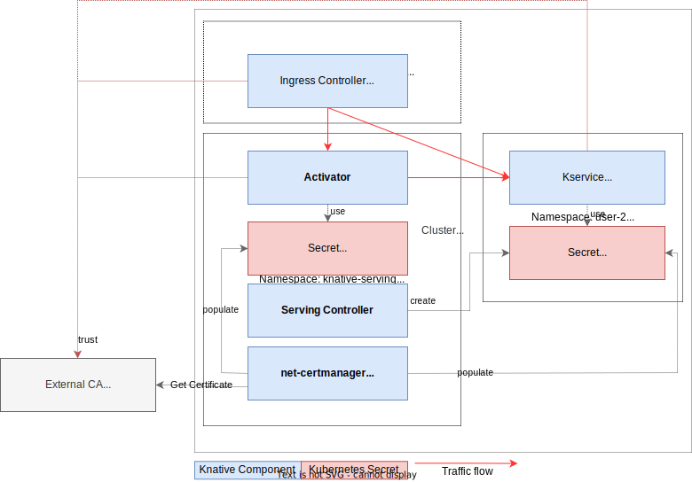

# Knative Serving Encryption

⛔️ Warning: not everything is implemented, as Knative Serving encryption is still a work-in-progress. Tracking project: https://github.com/orgs/knative/projects/63/views/1

## Overview
There are three parts to Knative Serving encryption
* (1) HTTPS on the ingress layer _external_ to the cluster (cluster external domain, like `myapp-<namespace>.example.com`).
* (2) HTTPS on the ingress layer _internal_ to the cluster (cluster local domains, like `myapp.<namespace>.svc.cluster.local`).
* (3) HTTPS between Knative internal components (`ingress-controller`, `activator`, `queue-proxy`).

📝 Note: currently all control-plane traffic (including Kubernetes PreStopHooks and metadata like metrics) are not (yet) encrypted.

## The parts in detail
The different parts are independent of each other and (can) use different Certificate Authorities to sign the necessary certificates.

### (1) External domain

* Certificate CN/SAN contains the external domain of a Knative Service, e.g. `myapp-<namespace>.example.com`.
* The certificates are hosted using SNI by the external endpoint of the ingress-controller.
* The caller has to trust the (external) CA that signed the certificates (this is out of the scope of Knative).
* These certificates are either [provided manually](https://knative.dev/docs/serving/using-a-tls-cert/) or by using an implementation to the [Knative Certificate abstraction](https://github.com/knative/networking/blob/main/pkg/apis/networking/v1alpha1/certificate_types.go#L34). Currently, we support the [net-certmanager](https://github.com/knative-extensions/net-certmanager) implementation. 
* Please refer to the [documentation](https://knative.dev/docs/serving/encryption/enabling-automatic-tls-certificate-provisioning/) for more information.

### (2) Cluster-local certificates

* Certificate CN/SAN contains the cluster-local domain of a Knative Service, e.g. `myapp.namespace.svc.cluster.local`, `myapp.namespace.svc`, `myapp.namespace`.
* The certificates are hosted using SNI by the cluster-local endpoint of the ingress-controller.
* The caller has to trust the CA that signed the certificates (this is out of the scope of Knative). One option to do this is using [trust-manager](https://cert-manager.io/docs/trust/trust-manager/) from cert-manager.
* To create the certificates, Knative relies on [cert-manager](https://cert-manager.io/) and our bridging component [net-certmanager](https://github.com/knative-extensions/net-certmanager/). They need to be installed and configured for the feature to work.

### (3) Knative internal certificates

Knative internal system components (`ingress-controller`, `activator`, `queue-proxy`) are hosting TLS endpoints when this configuration is enabled.
* To get the certificates, Knative relies on [cert-manager](https://cert-manager.io/) and our bridging component [net-certmanager](https://github.com/knative-extensions/net-certmanager/). They need to be installed and configured for the feature to work.
* Specific SANs are used to verify each connection. Each component needs to trust the CA (possibly the full chain) that signed the certificates. For this, Knative system components will consume and trust a provided `CABundle`. The CA bundle needs to be provided by the cluster administrator, possibly using [trust-manager](https://cert-manager.io/docs/trust/trust-manager/) from cert-manager.
