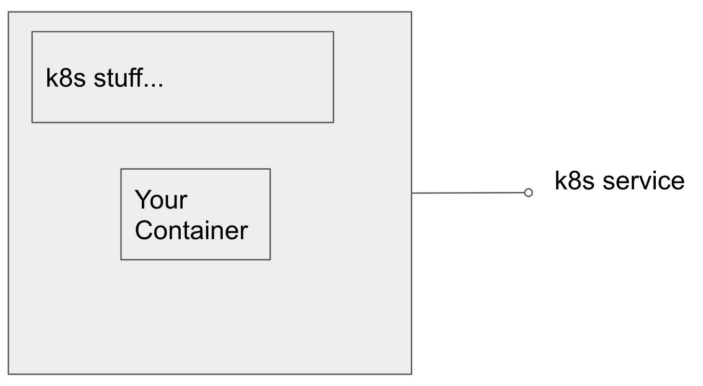

# API Objects - Revision

* Runs container images only
* Reifies k8s resources
  * Deployment (probably could just use ReplicaSet)
  * AutoScaler (currently uses horizontal pod autoscaler, looking at options here)
  * Service
  * Injects sidecars into the pods
* Scales to zero when not in use (goal, not implemented)

