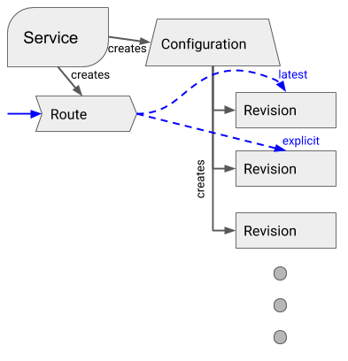

# API Objects

* Configuration
  * Desired current state of deployment (#HEAD).
  * Records the history of the code and configuration separately (following the [12-factor app methodology](https://12factor.net/)).
  * Stamps out revisions as it is updated.
* Revision
  * Snapshot of the code and configuration.
  * Uses Kubernetes infrastructure, such as [Deployment](https://kubernetes.io/docs/concepts/workloads/controllers/deployment/), [ReplicaSet](https://kubernetes.io/docs/concepts/workloads/controllers/replicaset/), and [Pods](https://kubernetes.io/docs/concepts/workloads/pods/pod/).
* Route
  * Assigns traffic to Revisions (fractional scaling or by name).
  * Built using [Istio](https://istio.io/docs/).
* Service
  * Acts as a top-level controller to orchestrate Route and Configuration.
  * Provides a simple entry point for UI and CLI tooling to achieve common behavior.
* Build
  * Executes builds.
  

