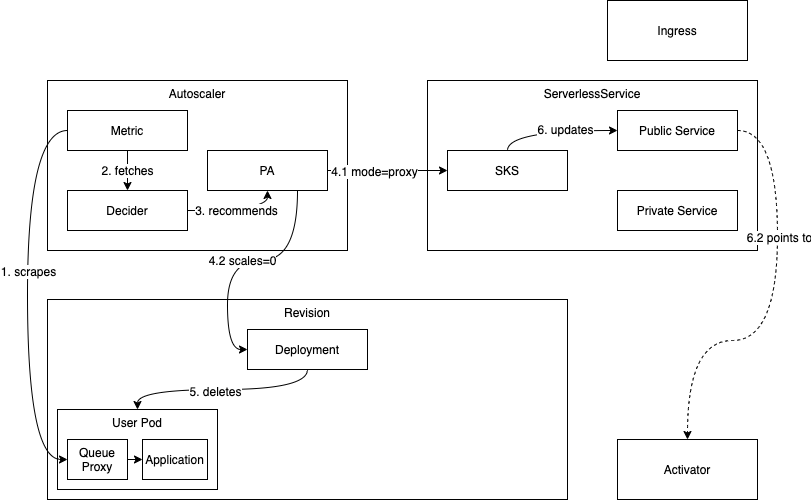

# Knative Serving Autoscaling System

This document describes the Knative Serving Autoscaling system and goes into the
details of how autoscaling is implemented in Knative Serving. It describes:

- The components that form the Knative Serving Autoscaling system
- The APIs at play that control the behavior of said components
- The in-depth control- and data-flows happening in various scenarios like
  scaling up/down and to/from zero

## Components

The autoscaling system consists of a few “physical” and logical components that
are briefly defined here. Understanding what they are, where they are deployed
and what they do will greatly help to understand the control- and data-flows.
The components mentioned might do more things than outlined here. This document
is going to stick only to the details that affect the autoscaling system.

### Queue Proxy

The **queue-proxy** is a sidecar container that is deployed alongside the
user-container in **each user pod**. Each request sent to an instance of the
application is going via the queue-proxy first, hence the “proxy” in its name.

The queue-proxy's main purpose is to **measure** and **limit concurrency** to
the user's application. If a revision defines a concurrency limit of 5, the
queue-proxy makes sure that no more than 5 requests reach the application's
instance at once. If there are more requests being sent to it than that, it will
queue them locally, hence the “queue” in its name. The queue-proxy also measures
the incoming request load and reports the **average concurrency** and **requests
per second** on a separate port.

### Autoscaler

The **autoscaler** is a stand-alone pod consisting of three main components:

1. The PodAutoscaler reconciler
2. The **Collector**
3. The **Decider**

The PodAutoscaler reconciler makes sure that any changes to PodAutoscalers (see
API section) are correctly picked up and reflected in either the Decider, the
Collector or both.

The collector is responsible for collecting metrics from the queue-proxies on
the application instances. To do so, it scrapes their internal metrics endpoint
and sums them up to get a metric representative of the entire system. For
scalability, only a sample of all application instances is scraped and the
received metrics are extrapolated to the entire cluster.

The decider gets all metrics available and decides how many pods the
application's deployment should be scaled to. Basically, the equation to do that
is `want = concurrencyInSystem/targetConcurrencyPerInstance`.

In addition to that, it adjusts the value for a maximum scale up/down rate and
the min- and max-instances settings on the revision. It also computes how much
burst capacity is left in the current deployment and thus determines whether or
not the activator can be taken off of the data-path or not.

### Activator

The **activator** is a globally shared deployment, that is very scalable. Its
main purposes are **buffering requests** and **reporting metrics** to the
autoscaler.

The activator is mainly involved around scale to/from zero and in capacity aware
loadbalancing. When a revision is scaled to zero instances, the activator will
be put into the data path instead of revision's instances. If requests would hit
this revision, the activator buffers these requests, pokes the autoscaler with
metrics and holds the requests until instances of the application appear. As
soon as that is the case, the activator will forward the requests it buffered to
the new instances while carefully avoiding to overload the existing instances of
the application. The activator effectively acts as a loadbalancer here. It
distributes the load across all the pods as they become available in a way that
doesn't overload them with regards to their concurrency settings. The activator
is put on or taken off the data-path as the system sees fit to allow it to act
as a loadbalancer as described above. If the current deployment has enough
headroom to make it not too prone to overload, the activator will be taken off
the data-path for minimal network overhead.

Unlike the queue-proxy, the activator actively sends metrics to the autoscaler
via a websocket connection to minimize scale-from-zero latencies as much as
possible.

## APIs

### PodAutoscaler (PA)

**API:** `podautoscalers.autoscaling.internal.knative.dev`

An abstraction for all possible PodAutoscalers. The default implementation is
the **Knative Pod Autoscaler (KPA)**. There is an adapter that implements
Kubernetes' HPA via this abstraction as well.

The PodAutoscaler controls the scaling target, the metric that's scaled on and
any other input that is relevant for the autoscaling decider or collector.

PodAutoscalers are automatically created from Revisions by default.

### Metric

**API:** `metrics.autoscaling.internal.knative.dev`

Metric is essentially the API surface to control the collector of the
autoscaler. It controls which service to scrape, how to aggregate the data and
more.

Metrics are automatically created from PodAutoscalers by default.

### Decider

**API:** Only exists in-memory today. Only here for completeness sake.

### ServerlessServices (SKS)

**API:** `serverlessservices.networking.internal.knative.dev`

An abstraction on top of Kubernetes Services that controls the data flow and
especially the switch between having the activator as a buffer on the data path
(for example when scaled to zero) or routing to the application instances
directly (when scaled above zero).

This is achieved by creating two Kubernetes services for each revision: A
**public** service and a **private** service.

The private service is a standard Kubernetes service. Its selector is set to
point to the application instances deployed and as the deployment grows and
shrinks, the list of available IPs will do so too.

The public service is an “unmanaged” Kubernetes service. It has no selector and
therefore does not automatically get endpoint management as the private service
does. The public service's endpoints are managed by the SKS reconciler directly.

The SKS has two modes: **`Proxy`** and **`Serve`**.

In mode `Serve`, the public service endpoints are exactly the same as those of
the private service. All traffic will flow to the revision's pods.

In mode `Proxy`, the public service endpoints are the addresses of all the
activators in the system. All traffic will flow to the activators.

ServerlessServices are created from PodAutoscalers.

## Data flow examples

<!-- Editable versions of the diagrams below are in the Knative shared drive in Scaling/images -->

### Scaling up and down (steady state)

At steady state, the autoscaler is constantly scraping the currently active
revision pods to adjust the scale of the revision constantly. As requests flow
into the system, the scraped values will change and the autoscaler will instruct
the revision's deployment to adhere to a given scale.

The SKS keeps track of the changes to the deployment's size through the private
service. It updates the public service accordingly.

### Scaling to zero

A revision scales to zero once there are no more requests in the system anymore.
All scrapes from the autoscaler to revision pods return 0 concurrency and the
activator reports the same (1).

Before actually removing the last pod of the revision the system makes sure that
the activator is in the path and routable. The autoscaler, who decided to
scale-to-zero in the first place, instructs the SKS to use **`Proxy`** mode, so
all traffic is directed at the activators (4.1). The SKS's public service is now
probed until it has been ensured to return responses from the activator. Once
that is the case and if a grace-period (configurable via
_scale-to-zero-grace-period_) has already passed, the last pod of the revision
is removed and the revision has successfully scaled to zero (5).

### Scaling from zero

If a revision is scaled to zero and a request comes into the system trying to
reach this revision, the system needs to scale it up. As the SKS is in
**`Proxy`** mode, the request will reach the activator (1), which will count it
and report its appearance to the autoscaler (2.1). The activator will then
buffer the request and watch the SKS's private service for endpoints to appear
(2.2).

The autoscaler gets the metric from the activator and immediately runs an
autoscaling cycle (3). That process will determine that at least one pod is be
desired (4) and the autoscaler will instruct the revision's deployment to scale
up to N > 0 replicas (5.1). It also puts the SKS into **`Serve`** mode, causing
the traffic to flow to the revision's pods directly, once they come up (5.2).

The activator eventually sees the endpoints coming up and starts probing it.
Once the probe passes successfully, the respective address will be considered
healthy and used to route the request we buffered and all additional requests
that arrived in the meantime (8.2).

The revision has been successfully scaled from zero.
