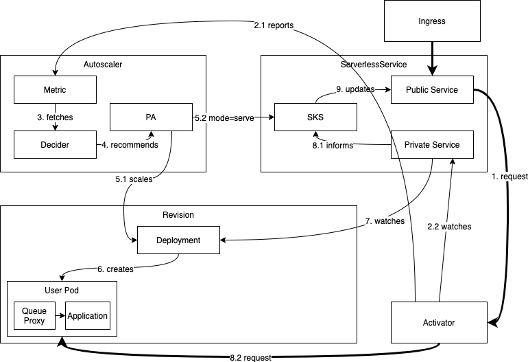

# Knative Serving Autoscaling System

## APIs

### PodAutoscaler (PA)

**API:** `podautoscalers.autoscaling.internal.knative.dev`

An abstraction for all possible PodAutoscalers. The default implementation is
the **Knative Pod Autoscaler (KPA)**. There is an adapter that implements
Kubernetes' HPA via this abstraction as well.

The PodAutoscaler controls the scaling target, the metric that's scaled on and
any other input that is relevant for the autoscaling decider or collector.

PodAutoscalers are automatically created from Revisions by default.

### Metric

**API:** `metrics.autoscaling.internal.knative.dev`

Metric is essentially the API surface to control the collector of the
autoscaler. It controls which service to scrape, how to aggregate the data and
more.

Metrics are automatically created from PodAutoscalers by default.

### Decider

**API:** Only exists in-memory today. Only here for completeness sake.

### ServerlessServices (SKS)

**API:** `serverlessservices.networking.internal.knative.dev`

An abstraction on top of Kubernetes Services that controls the data flow and
especially the switch between having the activator as a buffer on the data path
(for example when scaled to zero) or routing to the application instances
directly (when scaled above zero).

This is achieved by creating two Kubernetes services for each revision: A
**public** service and a **private** service.

The private service is a standard Kubernetes service. Its selector is set to
point to the application instances deployed and as the deployment grows and
shrinks, the list of available IPs will do so too.

The public service is an “unmanaged” Kubernetes service. It has no selector and
therefore does not automatically get endpoint management as the private service
does. The public service's endpoints are managed by the SKS reconciler directly.

The SKS has two modes: **`Proxy`** and **`Serve`**.

In mode `Serve`, the public service endpoints are exactly the same as those of
the private service. All traffic will flow to the revision's pods.

In mode `Proxy`, the public service endpoints are the addresses of all the
activators in the system. All traffic will flow to the activators.

ServerlessServices are created from PodAutoscalers.

## Data flow examples

<!-- Editable versions of the diagrams below are in the Knative shared drive in Scaling/images -->

### Scaling up and down (steady state)

At steady state, the autoscaler is constantly scraping the currently active
revision pods to adjust the scale of the revision constantly. As requests flow
into the system, the scraped values will change and the autoscaler will instruct
the revision's deployment to adhere to a given scale.

The SKS keeps track of the changes to the deployment's size through the private
service. It updates the public service accordingly.

### Scaling to zero

A revision scales to zero once there are no more requests in the system anymore.
All scrapes from the autoscaler to revision pods return 0 concurrency and the
activator reports the same (1).

Before actually removing the last pod of the revision the system makes sure that
the activator is in the path and routable. The autoscaler, who decided to
scale-to-zero in the first place, instructs the SKS to use **`Proxy`** mode, so
all traffic is directed at the activators (4.1). The SKS's public service is now
probed until it has been ensured to return responses from the activator. Once
that is the case and if a grace-period (configurable via
_scale-to-zero-grace-period_) has already passed, the last pod of the revision
is removed and the revision has successfully scaled to zero (5).

### Scaling from zero

If a revision is scaled to zero and a request comes into the system trying to
reach this revision, the system needs to scale it up. As the SKS is in
**`Proxy`** mode, the request will reach the activator (1), which will count it
and report its appearance to the autoscaler (2.1). The activator will then
buffer the request and watch the SKS's private service for endpoints to appear
(2.2).

The autoscaler gets the metric from the activator and immediately runs an
autoscaling cycle (3). That process will determine that at least one pod is be
desired (4) and the autoscaler will instruct the revision's deployment to scale
up to N > 0 replicas (5.1). It also puts the SKS into **`Serve`** mode, causing
the traffic to flow to the revision's pods directly, once they come up (5.2).

The activator eventually sees the endpoints coming up and starts probing it.
Once the probe passes successfully, the respective address will be considered
healthy and used to route the request we buffered and all additional requests
that arrived in the meantime (8.2).

The revision has been successfully scaled from zero.
