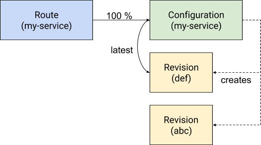
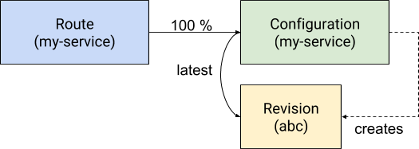
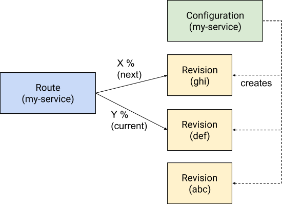
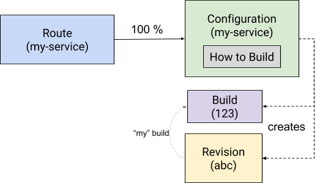

# Sample API Usage

Following are several normative sample scenarios utilizing the Knative Serving
API. These scenarios are arranged to provide a flavor of the API and
building from the smallest, most frequent operations.

Examples in this section illustrate:

* [Automatic rollout of a new Revision to an existing Service with a
  pre-built container](#1-automatic-rollout-of-a-new-revision-to-existing-service---pre-built-container)
* [Creating a new Service with a pre-built container](#2-creating-a-new-service-with-a-pre-built-container)
* [Configuration changes and manual rollout
  options](#3-manual-rollout-of-a-new-revision---config-change-only)
* [Creating a revision from source](#4-deploy-a-revision-from-source)
* [Creating a function from source](#5-deploy-a-function)

Note that these API operations are identical for both app and function
based services. (to see the full resource definitions, see the
[Resource YAML Definitions](spec.md)).

CLI samples are for illustrative purposes, and not intended to
represent final CLI design.

## 1) Automatic rollout of a new Revision to existing Service - pre-built container

**_Scenario_**: User deploys a new revision to an existing service
with a new container image, rolling out automatically to 100%

```console
$ knative deploy --service my-service
  Deploying app to service [my-service]:
✓ Starting
✓ Promoting
  Done.
  Deployed to https://my-service.default.mydomain.com
```

**Steps**:

* Update the Service with the config change

**Results:**

* The Configuration associated with the Service is updated, and a new
  Revision is created, and automatically rolled out to 100% once ready.



After the initial Route and Configuration have been created (which is shown
in the
[second example](#2-creating-a-new-service-with-a-pre-built-container)),
the typical interaction is to update the revision configuration, resulting
in the creation of a new revision, which will be automatically rolled out by
the route. Revision configuration updates can be handled as either a PUT or
PATCH operation:

* Optimistic concurrency controls for PUT operations in a
  read/modify/write routine work as expected in kubernetes.

* PATCH semantics should work as expected in kubernetes, but may have
  some limitations imposed by CRDs at the moment.

In this and following examples PATCH is used. Revisions can be built
from source, which results in a container image, or by directly
supplying a pre-built container, which this first scenario
illustrates. The example demonstrates the PATCH issued by the client,
followed by several GET calls to illustrate each step in the
reconciliation process as the system materializes the new revision,
and begins shifting traffic from the old revision to the new revision.

The client PATCHes the service's configuration with new container image,
inheriting previous environment values from the configuration spec:

```http
PATCH /apis/serving.knative.dev/v1alpha1/namespaces/default/services/my-service
```

```yaml
apiVersion: serving.knative.dev/v1alpha1
kind: Service
metadata:
  name: my-service
spec:
  runLatest:
    configuration:
      revisionTemplate:  # template for building Revision
        spec:
          container:
            image: gcr.io/...  # new image
```

This causes the controller to PATCH the configuration's template revision
with the new container image:

```http
PATCH /apis/serving.knative.dev/v1alpha1/namespaces/default/configurations/my-service
```

```yaml
apiVersion: serving.knative.dev/v1alpha1
kind: Configuration
metadata:
  name: my-service  # Named the same as the Service
spec:
  revisionTemplate:  # template for building Revision
    spec:
      container:
        image: gcr.io/...  # new image
```

The update to the Configuration triggers a new Revision being created, and
the Configuration and Service are updated to reflect the new Revision:

```http
GET /apis/serving.knative.dev/v1alpha1/namespaces/default/configurations/my-service
```

```yaml
apiVersion: serving.knative.dev/v1alpha1
kind: Configuration
metadata:
  name: my-service
  generation: 1235
 ...

spec:
  ... # same as before, except new container.image
status:
  latestReadyRevisionName: abc
  latestCreatedRevisionName: def # new revision created, but not ready yet
  observedGeneration: 1235
```

```http
GET /apis/serving.knative.dev/v1alpha1/namespaces/default/services/my-service
```

```yaml
apiVersion: serving.knative.dev/v1alpha1
kind: Service
metadata:
  name: my-service
  generation: 1452
 ...

spec:
  ... # same as before, except new container.image
status:
  latestReadyRevisionName: abc
  latestCreatedRevisionName: def # new revision created, but not ready yet
  observedGeneration: 1452
```

The newly created revision has the same config as the previous
revision, but different code. Note the generation label reflects the
new generation of the configuration (1235), indicating the provenance
of the revision:

```http
GET /apis/serving.knative.dev/v1alpha1/namespaces/default/revisions/def
```

```yaml
apiVersion: serving.knative.dev/v1alpha1
kind: Revision
metadata:
  name: def
  labels:
    knative.dev/configuration: my-service
    knative.dev/configurationGeneration: 1235
  ...
spec:
  container:  # k8s core.v1.Container
    image: gcr.io/...  # new container
    # same config as previous revision
    env:
    - name: FOO
      value: bar
    - name: HELLO
      value: blurg
  ...
status:
  conditions:
   - type: Ready
     status: True
```

When the new revision is Ready, i.e. underlying resources are
materialized and ready to serve, the configuration (and service)
updates their `status.latestReadyRevisionName` to reflect the new
revision. The route, which is configured to automatically rollout new
revisions from the configuration, watches the configuration and is
notified of the `latestReadyRevisionName`, and begins migrating
traffic to it. During reconciliation, traffic may be routed to both
existing revision `abc` and new revision `def`:

```http
GET /apis/serving.knative.dev/v1alpha1/namespaces/default/routes/my-service
```

```yaml
apiVersion: serving.knative.dev/v1alpha1
kind: Route
metadata:
  name: my-service
  ...
spec:
  rollout:
    traffic:
    - configurationName: my-service
      percent: 100

status:
  # domain:
  # oss: my-service.namespace.mydomain.com
  domain: my-service.namespace.mydomain.com
  # percentages add to 100
  traffic:  # in status, all configurationName refs are dereferenced
  - revisionName: abc
    percent: 75
  - revisionName: def
    percent: 25
  conditions:
  - type: Ready
    status: False
```

And once reconciled, revision def serves 100% of the traffic :

```http
GET /apis/serving.knative.dev/v1alpha1/namespaces/default/routes/my-service
```

```yaml
apiVersion: serving.knative.dev/v1alpha1
kind: Route
metadata:
  name: my-service
  ...
spec:
  rollout:
    traffic:
    - configurationName: my-service
      percent: 100
status:
  domain: my-service.default.mydomain.com
  traffic:
  - revisionName: def
    percent: 100
  conditions:
  - type: Ready
    status: True
  ...
```

## 2) Creating a new Service with a pre-built container

**Scenario**: User creates a new Service and deploys their first
  Revision based on a pre-built container

```console
$ knative deploy --service my-service --region us-central1
✓ Creating service [my-service] in region [us-central1]
  Deploying app to service [my-service]:
✓ Uploading     [=================]
✓ Starting
✓ Promoting
  Done.
  Deployed to https://my-service.default.mydomain.com
```

**Steps**:

* Create a new Service. That Service will trigger creation of a new
  Configuration and a Route that references that configuration.

**Results**:

* A new Configuration is created, and generates a new Revision based
  on the configuration

* A new Route is created, referencing the configuration

* The route begins serving traffic to the Revision that was created by
  the configuration




The previous example assumed an existing Service with a Route and
Configuration to illustrate the common scenario of updating the
configuration to deploy a new revision to the service.

In this getting started example, deploying a first Revision is
accomplished by creating a new Service, which will create both a
Configuration and a new Route referring to that configuration. In
turn, the Configuration will generate a new Revision. Note that these
steps may occur in in parallel.

In the `runLatest` style of Service, the Route always references the
latest ready revision of a Configuration, as this example
illustrates. This is the most straightforward scenario that many
Knative Serving customers are expected to use, and is consistent with the
experience of deploying code that is rolled out immediately.  A Route
may also directly reference a Revision, which is shown in
[example 3](#3-manual-rollout-of-a-new-revision---config-change-only).

The example shows the POST calls issued by the client, followed by
several GET calls to illustrate each step in the reconciliation
process as the system materializes and begins routing traffic to the
revision.

The client creates the service in `runLatest` mode:

```http
POST /apis/serving.knative.dev/v1alpha1/namespaces/default/services
```

```yaml
apiVersion: serving.knative.dev/v1alpha1
kind: Service
metadata:
  name: my-service
spec:
  runLatest:
    configuration:
      revisionTemplate:  # template for building Revision
        metadata: ...
        spec:
          container: # k8s core.v1.Container
            image: gcr.io/...
            env:
            - name: FOO
              value: bar
            - name: HELLO
              value: world
          ...
```

This causes the service controller to create route and configuration
objects with the same name as the Service:

```http
GET /apis/serving.knative.dev/v1alpha1/namespaces/default/routes
```

```yaml
apiVersion: serving.knative.dev/v1alpha1
kind: Route
metadata:
  name: my-service
spec:
  rollout:
    traffic:
    - configurationName: my-service  # named reference to Configuration
      percent: 100  # automatically activate new Revisions from the configuration
```

```http
GET /apis/serving.knative.dev/v1alpha1/namespaces/default/configurations
```

```yaml
apiVersion: serving.knative.dev/v1alpha1
kind: Configuration
metadata:
  name: my-service  # By convention (not req'd), same name as the service.
                    # This will also be set as the "knative.dev/configuration"
                    # label on the created Revision.
spec:  # Contents from service's spec.runLatest.configuration
  revisionTemplate:
    metadata: ...
    spec:
      container: # k8s core.v1.Container
        image: gcr.io/...
        env:
        - name: FOO
          value: bar
        - name: HELLO
          value: world
      ...
```

Upon the creation of the configuration, the configuration controller
will create a new Revision, generating its name, and applying the spec
and metadata from the configuration, as well as new metadata labels:

```http
GET /apis/serving.knative.dev/v1alpha1/namespaces/default/revisions/abc
```

```yaml
apiVersion: serving.knative.dev/v1alpha1
kind: Revision
metadata:
  name: abc  # generated name
  labels:
    # name and generation of the configuration that created the revision
    knative.dev/configuration: my-service
    knative.dev/configurationGeneration: 1234
spec:
  ...  # spec from the configuration
status:
  conditions:
   - type: Ready
     status: False
     message: "Starting Instances"
```

Immediately after the revision is created, i.e. before underlying
resources have been fully materialized, the configuration is updated
with latestCreatedRevisionName:

```http
GET /apis/serving.knative.dev/v1alpha1/namespaces/default/configurations/my-service
```

```yaml
apiVersion: serving.knative.dev/v1alpha1
kind: Configuration
metadata:
  name: my-service
  generation: 1234
  ...  # uid, resourceVersion, creationTimestamp, selfLink, etc
spec:
  ...  # same as before
status:
  # latest created revision, may not have materialized yet
  latestCreatedRevisionName: abc
  observedGeneration: 1234
```

The configuration watches the revision, and when the revision is
updated as Ready (to serve), the latestReadyRevisionName is updated:

```http
GET /apis/serving.knative.dev/v1alpha1/namespaces/default/configurations/my-service
```

```yaml
apiVersion: serving.knative.dev/v1alpha1
kind: Configuration
metadata:
  name: my-service
  generation: 1234
  ...
spec:
  ...  # same as before
status:
  # the latest created and ready to serve. Watched by route
  latestReadyRevisionName: abc
  # latest created revision
  latestCreatedRevisionName: abc
  observedGeneration: 1234
```

The route, which watches the configuration `my-service`, observes the
change to `latestReadyRevisionName` and begins routing traffic to the
new revision `abc`, addressable as
`my-service.default.mydomain.com`. Once reconciled:

```http
GET /apis/serving.knative.dev/v1alpha1/namespaces/default/routes/my-service
```

```yaml
apiVersion: serving.knative.dev/v1alpha1
kind: Route
metadata:
  name: my-service
  generation: 2145
  ...
spec:
  rollout:
    traffic:
    - configurationName: my-service
      percent: 100

status:
  domain: my-service.default.mydomain.com

  traffic:  # in status, all configurationName refs are dereferenced to latest revision
  - revisionName: abc  # latestReadyRevisionName from configurationName in spec
    percent: 100

  conditions:
  - type: Ready
    status: True

  observedGeneration: 2145
```

The Service also watches the Configuration (and Route) and mirrors their status for convenience:

```http
GET /apis/serving.knative.dev/v1alpha1/namespaces/default/services/my-service
```

```yaml
apiVersion: serving.knative.dev/v1alpha1
kind: Service
metadata:
  name: my-service
  generation: 1
  ...
spec:
  ...  # same as before
status:
  # the latest created and ready to serve.
  latestReadyRevisionName: abc
  # latest created revision
  latestCreatedRevisionName: abc
  observedGeneration: 1
```


## 3) Manual rollout of a new Revision - config change only

**_Scenario_**: User updates configuration with new runtime arguments
  (env var change) to an existing service, tests the revision, then
  proceeds with a manually controlled rollout to 100%

```console
$ knative rollout --service my-service strategy manual

$ knative deploy --service my-service --env HELLO="blurg"
[...]

$ knative revisions list --service my-service
Name     Traffic  Id   Date                Deployer     Git SHA
next     0%       v3   2018-01-19 12:16    user1        a6f92d1
current  100%     v2   2018-01-18 20:34    user1        a6f92d1
                  v1   2018-01-17 10:32    user1        33643fc

$ knative rollout next percent 5
[...]
$ knative rollout next percent 50
[...]
$ knative rollout finish
[...]

$ knative revisions list --service my-service
Name          Traffic  Id   Date                Deployer      Git SHA
current,next  100%     v3   2018-01-19 12:16    user1         a6f92d1
                       v2   2018-01-18 20:34    user1         a6f92d1
                       v1   2018-01-17 10:32    user1         33643fc
```

**Steps**:

* Update the Service to switch from `runLatest` to `pinned` strategy.

* Update the Service with the new configuration (env var).

* Update the Service to address the new Revision.

**Results:**

* The system creates the new revision from the configuration,
  addressable at next.my-service... (by convention), but traffic is
  not routed to it until the percentage is manually ramped up. Upon
  completing the rollout, the next revision is now the current
  revision.




In the previous examples, the Service automatically made changes to
the configuration (newly created Revision) routable when they became
ready. While this pattern is useful for many scenarios such as
functions-as-a-service and simple development flows, the Service can
also reference Revisions directly in `pinned` mode to route traffic to
a specific Revision, which is suitable for rolling back a service to a known-good state. manually controlling
rollouts, i.e. testing a new revision prior to serving traffic. (Note:
see [Appendix B](complex_examples.md) for a semi-automatic variation
of manual rollouts).

The client updates the service to pin the current revision:

```http
PUT /apis/serving.knative.dev/v1alpha1/namespaces/default/services/my-service
```

```yaml
apiVersion: serving.knative.dev/v1alpha1
kind: Service
metadata:
  name: my-service
spec:
  pinned:
    revisionName: def
    configuration:  # Copied from spec.runLatest.configuration
      revisionTemplate:  # template for building Revision
        spec:
          container:
            image: gcr.io/...  # new image
```

This causes the Route to be updated to pin traffic the specified
revision (note that the Configuration between the two is equivalent,
and therefore unchanged).

```http
PATCH /apis/serving.knative.dev/v1alpha1/namespaces/default/routes/my-service
```

```yaml
apiVersion: serving.knative.dev/v1alpha1
kind: Route
metadata:
  name: my-service
spec:
  rollout:
    traffic:
    - revisionName: def
      name: current  # addressable as current.my-service.default.mydomain.com
      percent: 100
    - configurationName: my-service  # LatestReadyRevision of my-service
      name: next  # addressable as next.my-service.default.mydomain.com
      percent: 0 # no traffic yet
```

Next, the service is updated with the new variables, which causes the
service controller to update the Configuration, in this case updating
the environment but keeping the same container image:

```http
PATCH /apis/serving.knative.dev/v1alpha1/namespaces/default/services/my-service
```

```yaml
apiVersion: serving.knative.dev/v1alpha1
kind: Service
metadata:
  name: my-service
spec:
  pinned:
    configuration:  # Copied from spec.runLatest.configuration
      revisionTemplate:  # template for building Revision
        spec:
          container:
            env:  # k8s-style strategic merge patch, updating a single list value
            - name: HELLO
              value: blurg  # changed value
```

As in the previous example, the configuration is updated to trigger
the creation of a new revision:

```http
PATCH /apis/serving.knative.dev/v1alpha1/namespaces/default/configurations/my-service
```

```yaml
apiVersion: serving.knative.dev/v1alpha1
kind: Configuration
metadata:
  name: my-service
spec:
  revisionTemplate:
    spec:
      container:
        env: # k8s-style strategic merge patch, updating a single list value
        - name: HELLO
          value: blurg # changed value
```

A new revision `ghi` is created that has the same code as the previous
revision `def`, but different config:

```http
GET /apis/serving.knative.dev/v1alpha1/namespaces/default/revisions/ghi
```

```yaml
apiVersion: serving.knative.dev/v1alpha1
kind: Revision
metadata:
  name: ghi
   ...
spec:
  container:
    image: gcr.io/...  # same container as previous revision abc
    env:
    - name: FOO
      value: bar
    - name: HELLO
      value: blurg # changed value
  ...
status:
  conditions:
   - type: Ready
     status: True
```

Even when ready, the new revision does not automatically start serving
traffic, as the route was pinned to revision `def`.

Once the new revision is ready, the route will update the `next` name
to point to the revision `ghi`. The new revision will still not
receive any traffic by default, but can be accessed for testing,
verification, etc.

```http
GET /apis/serving.knative.dev/v1alpha1/namespaces/default/routes/my-service
```

```yaml
apiVersion: serving.knative.dev/v1alpha1
kind: Route
metadata:
  name: my-service
spec:
  rollout:
    traffic:
    - revisionName: def
      name: current  # addressable as current.my-service.default.mydomain.com
      percent: 100
    - configurationName: my-service  # LatestReadyRevision of my-service
      name: next  # addressable as next.my-service.default.mydomain.com
      percent: 0 # no traffic yet
status:
  domain: my-service.default.mydomain.com
  traffic:
  - revisionName: def
    name: current  # addressable as current.my-service.default.mydomain.com
    percent: 100
  - revisionName: ghi
    name: next # addressable as next.my-service.default.mydomain.com
    percent: 0
  conditions:
  - type: Ready
    status: True
```

After testing the new revision at
`next.my-service.default.mydomain.com`, it can be promoted to live by
updating the service to pin `ghi` as the new revision.

```http
PATCH /apis/serving.knative.dev/v1alpha1/namespaces/default/services/my-service
```

```yaml
apiVersion: serving.knative.dev/v1alpha1
kind: Service
metadata:
  name: my-service
spec:
  pinned:
    revisionname: ghi
```

This causes the service to update the route to assign.

```http
PATCH /apis/serving.knative.dev/v1alpha1/namespaces/default/routes/my-service
```

```yaml
apiVersion: serving.knative.dev/v1alpha1
kind: route
metadata:
  name: my-service
spec:
  rollout:
    traffic:
    - revisionName: ghi
      name: current
      percent: 100
    - configurationName: my-service  # LatestReadyRevision of my-service
      name: next
      percent: 0
```

Once the update has been completed, if the latest ready revision is
the same as the pinned revision, the names `current` and `next` will
point to the same revision. Both names are left in place so that
`next.my-service.default.mydomain.com` is always addressable.

```http
GET /apis/serving.knative.dev/v1alpha1/namespaces/default/routes/my-service
```

```yaml
apiVersion: serving.knative.dev/v1alpha1
kind: Route
metadata:
  name: my-service
spec:
  rollout:
    traffic:
    - revisionName: ghi # update for the next rollout, current = next
      name: current
      percent: 100
    - revisionName: ghi # optional: leave next as also referring to ghi
      name: next
      percent: 0
status:
  domain: my-service.default.mydomain.com
  traffic:
  - revisionName: ghi
    name: current  # addressable as current.my-service.default.mydomain.com
    percent: 100
  - revisionName: ghi
    name: next # addressable as next.my-service.default.mydomain.com
    percent: 0
  conditions:
  - type: Ready
    status: True
```


## 4) Deploy a Revision from source

**Scenario**: User deploys a revision to an existing service from
  source rather than a pre-built container

```console
$ knative deploy --service my-service
  Deploying app to service [my-service]:
✓ Uploading     [=================]
✓ Detected [node-8-9-4] runtime
✓ Building
✓ Starting
✓ Promoting
  Done.
  Deployed to https://my-service.default.mydomain.com
```

**Steps**:

* Create/Update the service, updating build source information and
  using a new container label.

**Results**:

* The Configuration is created/updated, which generates a container
  build and a new Revision based on the template, and can be rolled
  out per earlier examples



Previous examples demonstrated services created with pre-built
containers. Revisions can also be created by providing build
information to the service, which results in a container image built
by the system. The build information is supplied by inlining the
Kubernetes resource definition for a build resource in the Configuration.
This build resource may be any resource that culminates in a `Succeeded`
condition as outlined in our [conditions documentation](./errors.md).

Using knative/build as an examplar build resource, the client updates the
configuration in the service inlining a build spec:

```http
PATCH /apis/serving.knative.dev/v1alpha1/namespaces/default/service
```

```yaml
apiVersion: serving.knative.dev/v1alpha1
kind: Service
metadata:
  name: my-service
spec:
  runLatest:
    configuration:
      build:
        # Example is in terms of knative/build, but this may be any
        # Kubernetes resource that culminates in a Succeeded condition
        # as outlined in errors.md
        apiVersion: build.knative.dev/v1alpha1
        kind: Build
        spec: ...

      revisionTemplate:  # template for building Revision
        metadata: ...
        spec:
          container:  # k8s core.v1.Container
            image: gcr.io/...  # Promise of a future build. Same as supplied in
                               # build.template.arguments[_IMAGE]
            env:  # Updated environment variables to go live with new source.
            - name: FOO
              value: bar
            - name: HELLO
              value: world
```

Note the `revisionTemplate.spec.container.image` above is supplied
with the destination of the build. This enables one-step changes to
both environment and source code. If the build step were responsible for
updating the `revisionTemplate.spec.container.image` at the completion
of the build, an update to both source and config could result in the
creation of two Revisions, one with the config change, and the other
with the new code deployment. It is expected that Revision will wait
for the `buildRef` to reach a "Succeeded" state and the
`revisionTemplate.spec.container.image` to be live before marking the
Revision as "Ready".

Upon creating/updating the service's configuration, the contents are
copied into the corresponding Configuration object. Once updated, the
configuration controller creates a new revision. The configuration
controller will also create a build, populating the revision’s
buildRef with a reference to the underlying Build resource. The
revision controller watches status updates on the build reference, and
the high-level state of the build is mirrored into conditions in the
Revision’s status for convenience:

```http
GET /apis/serving.knative.dev/v1alpha1/namespaces/default/revisions/abc
```

```yaml
apiVersion: serving.knative.dev/v1alpha1
kind: Revision
metadata:
  name: abc
  labels:
    knative.dev/configuration: my-service
    knative.dev/configurationGeneration: 1234
  ...
spec:
  # Reference to the build resource to track.
  # Set by Configuration.
  buildRef: # K8s core.v1.ObjectReference
    apiVersion: ...
    kind: ...
    name: ...

  # spec from the configuration, with container.image containing the
  # newly built container
  container: # k8s core.v1.Container
    image: gcr.io/...
    env:
    - name: FOO
      value: bar
    - name: HELLO
      value: world
status:
  # This is a copy of metadata from the container image or grafeas, indicating
  # the provenance of the revision, annotated on the container
  imageSource:
    archive|manifest|repository: ...
    context: ...
  conditions:
  - type: Ready
    status: True
  - type: BuildSucceeded
    status: True
```

Rollout operations in the route are identical to the pre-built
container examples.

Also analogous is creating the service from scratch with source
files - in this case, the source would be provided to the
configuration's inlined build spec, which would initiate a new
container build, and the creation of a new revision. If the first
build fails `LatestReadyRevisionName` will be entirely unset until a
Revision is created which can become ready.


## 5) Deploy a Function

**Scenario**: User deploys a new function revision to an existing service

```console
$ knative deploy --function index --service my-function
  Deploying function to service [my-function]:
✓ Uploading     [=================]
✓ Detected [node-8-9-4] runtime
✓ Building
✓ Starting
✓ Promoting
  Done.
  Deployed to https://my-function.default.mydomain.com
```

**Steps**:

* Create/Update a service, specifying source code and function
  details.

**Results**:

* The Configuration is created/updated, which generates a new revision
  based on the template build and spec which can be rolled out per
  previous examples


Previous examples illustrated creating and deploying revisions in the
context of application containers.  Functions are created and deployed
in the same manner (in particular, as containers which respond to
HTTP). In the build phase of the deployment, additional function
metadata may be taken into account in order to wrap the supplied code
in a language-specific functions framework which translates from HTTP
to language-native constructs.

Functions are configured with a language-specific entryPoint. The
entryPoint may be provided as an argument to the build template, if
language-native autodetection is insufficient. By convention, a type
metadata label may also be added that designates revisions as a
function, supporting listing revisions by type; there is no change to
the system behavior based on type.

Note that a function may be connected to one or more event sources via
Bindings in the Eventing API; the binding of events to functions is
not a core function of the compute API.

Creating the service with build and function metadata:

```http
POST /apis/serving.knative.dev/v1alpha1/namespaces/default/services
```

```yaml
apiVersion: serving.knative.dev/v1alpha1
kind: Service
metadata:
  name: my-function
spec:
  runLatest:
    configuration:
      build:
        # knative/build as an example.
        apiVersion: build.knative.def/v1alpha1
        kind: Build
        spec:
          source:
            git:
              url: https://...
              commit: ...
          template:  # defines build template
            name: go_1_9_fn  # function builder
            namespace: build-templates
            arguments:
            - name: _IMAGE
              value: gcr.io/...  # destination for image
            - name: _ENTRY_POINT
              value: index  # language dependent, function-only entrypoint

      revisionTemplate:  # template for building Revision
        metadata:
          labels:
            # One-of "function" or "app", convention for CLI/UI clients to list/select
            knative.dev/type: "function"
        spec:
          container:  # k8s core.v1.Container
            image: gcr.io/...  # Promise of a future build. Same as supplied in
                               # build.template.arguments[_IMAGE]
            env:
            - name: FOO
              value: bar
            - name: HELLO
              value: world

          # serializes requests for function. Default value for functions
          concurrencyModel: SingleThreaded
          # max time allowed to respond to request
          timeoutSeconds: 20
```

Upon creating or updating the service, values are copied to the
configuration, which causes a new Revision to be created per the
previous examples. Rollout operations are also identical to the
previous examples.
