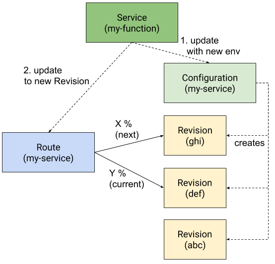

# Sample API Usage

Following are several normative sample scenarios utilizing the Knative Serving
API. These scenarios are arranged to provide a flavor of the API and building
from the smallest, most frequent operations.

Examples in this section illustrate:

- [Automatic rollout of a new Revision to an existing Service](#1-automatic-rollout-of-a-new-revision-to-existing-service)
- [Creating a new Service](#2-creating-a-new-service)
- [Configuration changes and managed rollout options](#3-managed-release-of-a-new-revision---config-change-only)
- [Roll back to a known-good revision](#4-roll-back-to-a-known-good-revision)

Note that Serving operates at the level of an HTTP-based service, which **can**
support FaaS, PaaS, and CaaS workloads, but the expectation is that the
translation from Function or App to Container is handled by Build-level
code-generation, and we deal with Containers as the canonical packaging unit.
See the [knative/build](https://github.com/knative/build) and
[Tekton](https://github.com/tektoncd) projects for complementary build-capable
resources.

CLI samples are for illustrative purposes, and not intended to represent final
CLI design.

## 1) Automatic rollout of a new Revision to existing Service

**_Scenario_**: User deploys a new revision to an existing service with a new
container image, rolling out automatically to 100%

```console
$ knative deploy --service my-service
  Deploying app to service [my-service]:
✓ Starting
✓ Promoting
  Done.
  Deployed revision v3 to https://my-service.default.mydomain.com
```

**Steps**:

- Update the Service with the config change

**Results:**

- The Configuration associated with the Service is updated, and a new Revision
  is created, and automatically rolled out to 100% once ready.


After the initial Route and Configuration have been created (which is shown in
the [second example](#2-creating-a-new-service)), the typical interaction is to
update the revision configuration, resulting in the creation of a new revision,
which will be automatically rolled out by the route. Revision configuration
updates can be handled as either a PUT or PATCH operation:

- Optimistic concurrency controls for PUT operations in a read/modify/write
  routine work as expected in kubernetes.

- PATCH semantics should work as expected in kubernetes, but may have some
  limitations imposed by CRDs at the moment.

In this and following examples PATCH is used. Revisions are built by directly
supplying a container, which this first scenario illustrates. The example
demonstrates the PATCH issued by the client, followed by several GET calls to
illustrate each step in the reconciliation process as the system materializes
the new revision, and begins shifting traffic from the old revision to the new
revision.

The client PATCHes the service's configuration with new container image,
inheriting previous environment values from the configuration spec:

```http
PATCH /apis/serving.knative.dev/v1alpha1/namespaces/default/services/my-service
```

```yaml
apiVersion: serving.knative.dev/v1alpha1
kind: Service
metadata:
  name: my-service
spec:
  template: # template for building Revision
    spec:
      containers:
        - image: gcr.io/... # new image
```

This causes the controller to update the configuration's template revision with
the new container image:

```yaml
apiVersion: serving.knative.dev/v1alpha1
kind: Configuration
metadata:
  name: my-service # Named the same as the Service
spec:
  tempate: # template for building Revision
    spec:
      containers:
        - image: gcr.io/... # new image
```

The update to the Configuration triggers a new Revision being created, and the
Configuration and Service are updated to reflect the new Revision:

```http
GET /apis/serving.knative.dev/v1alpha1/namespaces/default/configurations/my-service
```

```yaml
apiVersion: serving.knative.dev/v1alpha1
kind: Configuration
metadata:
  name: my-service
  generation: 1235
 ...

spec:
  ... # same as before, except new container.image
status:
  latestReadyRevisionName: abc
  latestCreatedRevisionName: def # new revision created, but not ready yet
  observedGeneration: 1235
```

```http
GET /apis/serving.knative.dev/v1alpha1/namespaces/default/services/my-service
```

```yaml
apiVersion: serving.knative.dev/v1alpha1
kind: Service
metadata:
  name: my-service
  generation: 1452
 ...

spec:
  ... # same as before, except new container.image
status:
  latestReadyRevisionName: abc
  latestCreatedRevisionName: def # new revision created, but not ready yet
  observedGeneration: 1452
```

The newly created revision has the same config as the previous revision, but
different code. Note the generation label reflects the new generation of the
configuration (1235), indicating the provenance of the revision:

```http
GET /apis/serving.knative.dev/v1alpha1/namespaces/default/revisions/def
```

```yaml
apiVersion: serving.knative.dev/v1alpha1
kind: Revision
metadata:
  name: def
  labels:
    knative.dev/configuration: my-service
    knative.dev/configurationGeneration: 1235
  ...
spec:
  containers:  # k8s []core.v1.Container
  - image: gcr.io/...  # new container
    # same config as previous revision
    env:
    - name: FOO
      value: bar
    - name: HELLO
      value: blurg
  ...
status:
  conditions:
   - type: Ready
     status: True
```

When the new revision is Ready, i.e. underlying resources are materialized and
ready to serve, the configuration (and service) updates their
`status.latestReadyRevisionName` to reflect the new revision. The route, which
is configured to automatically rollout new revisions from the configuration,
watches the configuration and is notified of the `latestReadyRevisionName`, and
begins migrating traffic to it. During reconciliation, traffic may be routed to
both existing revision `abc` and new revision `def`:

```http
GET /apis/serving.knative.dev/v1alpha1/namespaces/default/routes/my-service
```

```yaml
apiVersion: serving.knative.dev/v1alpha1
kind: Route
metadata:
  name: my-service
  ...
spec:
  traffic:
  - configurationName: my-service
    percent: 100

status:
  # url:
  url: http://my-service.namespace.mydomain.com
  # percentages add to 100
  traffic:  # in status, all configurationName refs are dereferenced
  - revisionName: abc
    percent: 75
  - revisionName: def
    percent: 25
  conditions:
  - type: Ready
    status: False
```

And once reconciled, revision def serves 100% of the traffic :

```http
GET /apis/serving.knative.dev/v1alpha1/namespaces/default/routes/my-service
```

```yaml
apiVersion: serving.knative.dev/v1alpha1
kind: Route
metadata:
  name: my-service
  ...
spec:
  traffic:
  - configurationName: my-service
    percent: 100
status:
  url: http://my-service.default.mydomain.com
  traffic:
  - revisionName: def
    percent: 100
  conditions:
  - type: Ready
    status: True
  ...
```

## 2) Creating a new Service

**Scenario**: User creates a new Service and deploys their first Revision.

```console
$ knative deploy --service my-service --region us-central1
✓ Creating service [my-service] in region [us-central1]
  Deploying app to service [my-service]:
✓ Uploading     [=================]
✓ Starting
✓ Promoting
  Done.
  Deployed to https://my-service.default.mydomain.com
```

**Steps**:

- Create a new Service. That Service will trigger creation of a new
  Configuration and a Route that references that configuration.

**Results**:

- A new Configuration is created, and generates a new Revision based on the
  configuration

- A new Route is created, referencing the configuration

- The route begins serving traffic to the Revision that was created by the
  configuration


The previous example assumed an existing Service with a Route and Configuration
to illustrate the common scenario of updating the configuration to deploy a new
revision to the service.

In this getting started example, deploying a first Revision is accomplished by
creating a new Service, which will create both a Configuration and a new Route
referring to that configuration. In turn, the Configuration will generate a new
Revision. Note that these steps may occur in in parallel.

With the Service defaults, the Route will reference the latest ready revision of
a Configuration, as this example illustrates. This is the most straightforward
scenario that many Knative Serving customers are expected to use, and is
consistent with the experience of deploying code that is rolled out immediately.
A Route may also directly reference a Revision, which is shown in
[example 3](#3-managed-release-of-a-new-revision---config-change-only).

The example shows the POST calls issued by the client, followed by several GET
calls to illustrate each step in the reconciliation process as the system
materializes and begins routing traffic to the revision.

The client creates the service:

```http
POST /apis/serving.knative.dev/v1alpha1/namespaces/default/services
```

```yaml
apiVersion: serving.knative.dev/v1alpha1
kind: Service
metadata:
  name: my-service
spec:
  template:  # template for building Revision
    metadata: ...
    spec:
      containers: # k8s core.v1.Container
      - image: gcr.io/...
        env:
        - name: FOO
          value: bar
        - name: HELLO
          value: world
      ...
```

This causes the service controller to create route and configuration objects
with the same name as the Service:

```http
GET /apis/serving.knative.dev/v1alpha1/namespaces/default/routes
```

```yaml
apiVersion: serving.knative.dev/v1alpha1
kind: Route
metadata:
  name: my-service
spec:
  traffic:
    - configurationName: my-service # named reference to Configuration
      percent: 100 # automatically activate new Revisions from the configuration
```

```http
GET /apis/serving.knative.dev/v1alpha1/namespaces/default/configurations
```

```yaml
apiVersion: serving.knative.dev/v1alpha1
kind: Configuration
metadata:
  name: my-service  # By convention (not req'd), same name as the service.
                    # This will also be set as the "knative.dev/configuration"
                    # label on the created Revision.
spec:
  template:
    metadata: ...
    spec:
      containers: # k8s core.v1.Container
      - image: gcr.io/...
        env:
        - name: FOO
          value: bar
        - name: HELLO
          value: world
      ...
```

Upon the creation of the configuration, the configuration controller will create
a new Revision, generating its name, and applying the spec and metadata from the
configuration, as well as new metadata labels:

```http
GET /apis/serving.knative.dev/v1alpha1/namespaces/default/revisions/abc
```

```yaml
apiVersion: serving.knative.dev/v1alpha1
kind: Revision
metadata:
  name: abc # generated name
  labels:
    # name and generation of the configuration that created the revision
    knative.dev/configuration: my-service
    knative.dev/configurationGeneration: 1234
spec: ... # spec from the configuration
status:
  conditions:
    - type: Ready
      status: False
      message: "Starting Instances"
```

Immediately after the revision is created, i.e. before underlying resources have
been fully materialized, the configuration is updated with
latestCreatedRevisionName:

```http
GET /apis/serving.knative.dev/v1alpha1/namespaces/default/configurations/my-service
```

```yaml
apiVersion: serving.knative.dev/v1alpha1
kind: Configuration
metadata:
  name: my-service
  generation: 1234
  ...  # uid, resourceVersion, creationTimestamp, selfLink, etc
spec:
  ...  # same as before
status:
  # latest created revision, may not have materialized yet
  latestCreatedRevisionName: abc
  observedGeneration: 1234
```

The configuration watches the revision, and when the revision is updated as
Ready (to serve), the latestReadyRevisionName is updated:

```http
GET /apis/serving.knative.dev/v1alpha1/namespaces/default/configurations/my-service
```

```yaml
apiVersion: serving.knative.dev/v1alpha1
kind: Configuration
metadata:
  name: my-service
  generation: 1234
  ...
spec:
  ...  # same as before
status:
  # the latest created and ready to serve. Watched by route
  latestReadyRevisionName: abc
  # latest created revision
  latestCreatedRevisionName: abc
  observedGeneration: 1234
```

The route, which watches the configuration `my-service`, observes the change to
`latestReadyRevisionName` and begins routing traffic to the new revision `abc`,
addressable as `my-service.default.mydomain.com`. Once reconciled:

```http
GET /apis/serving.knative.dev/v1alpha1/namespaces/default/routes/my-service
```

```yaml
apiVersion: serving.knative.dev/v1alpha1
kind: Route
metadata:
  name: my-service
  generation: 2145
  ...
spec:
  traffic:
  - configurationName: my-service
    percent: 100

status:
  url: http://my-service.default.mydomain.com

  traffic:  # in status, all configurationName refs are dereferenced to latest revision
  - revisionName: abc  # latestReadyRevisionName from configurationName in spec
    percent: 100

  conditions:
  - type: Ready
    status: True

  observedGeneration: 2145
```

The Service also watches the Configuration (and Route) and mirrors their status
for convenience:

```http
GET /apis/serving.knative.dev/v1alpha1/namespaces/default/services/my-service
```

```yaml
apiVersion: serving.knative.dev/v1alpha1
kind: Service
metadata:
  name: my-service
  generation: 1
  ...
spec:
  ...  # same as before
status:
  # the latest created and ready to serve.
  latestReadyRevisionName: abc
  # latest created revision
  latestCreatedRevisionName: abc
  observedGeneration: 1
```

## 3) Managed release of a new Revision - config change only

**_Scenario_**: User updates configuration with new runtime arguments (env var
change) to an existing service, tests the revision, then proceeds with a
human-controlled rollout to 100%. This scenario also illustrates being able to
"bring your own revision name" to be able to rewrite the routing rules at the
same time as the Revision is created (it will wait for the Revision to become
Ready).

```
$ knative release --service my-service strategy release

$ knative revisions list --service my-service
Route           Traffic  Id    Date                Deployer
current,latest  100%     def   2018-01-18 20:34    user1
                         abc   2018-01-17 10:32    user1

$ knative deploy --service my-service --env HELLO="blurg" --name="ghi"
[...]
Deployed revision ghi to https://latest.my-service.default.mydomain.com
You can begin rolling out this revision with [knative release begin ghi]

$ knative revisions list --service my-service
Route            Traffic  Id    Date                Deployer
latest,candidate 0%       ghi   2018-01-19 12:16    user1
current          100%     def   2018-01-18 20:34    user1
                          abc   2018-01-17 10:32    user1

$ knative release --service my-service begin ghi

$ knative revisions list --service my-service
Route             Traffic  Id    Date                Deployer
candidate,latest  0%       ghi   2018-01-19 12:16    user1
current           100%     def   2018-01-18 20:34    user1
                           abc   2018-01-17 10:32    user1

$ knative release percent 5
[...]

$ knative revisions list --service my-service
Route             Traffic  Id    Date                Deployer
candidate,latest  5%       ghi   2018-01-19 12:16    user1
current           95%      def   2018-01-18 20:34    user1
                           abc   2018-01-17 10:32    user1

$ knative release --service my-service percent 50
[...]
$ knative release --service my-service finish
[...]

$ knative revisions list --service my-service
Route             Traffic  Id    Date                Deployer
current,latest    100%     ghi   2018-01-19 12:16    user1
                           def   2018-01-18 20:34    user1
                           abc   2018-01-17 10:32    user1
```

**Steps**:

- Update the Service's `traffic` block from the default using
  `latestRevision: true` to one using a specific `revisionName`.

- Update the Service with the new configuration (env var), and a name for that
  new Revision.

- Update the Service's `traffic` to reference the new revision as `candidate`.

- Adjust the `percentRollout` controlling the traffic on `candidate`.

- Complete the rollout so the new revision is `current`.

**Results:**

- The system creates the new revision from the configuration, addressable at a
  url available in `status.traffic`, but none of the main traffic is routed to
  it until the rollout has adjusted the assigned percentage. Upon completing the
  rollout, the candidate revision is now the current revision.



In the previous examples, the Service automatically made changes to the
configuration (newly created Revision) routable when they became ready. While
this pattern is useful for many scenarios such as functions-as-a-service and
simple development flows, the Service can also reference Revisions directly to
route traffic to specific revisions. This is also useful for rollbacks. (Note:
see [example 3](#3-managed-release-of-a-new-revision---config-change-only) for a
semi-automatic variation of managed rollouts).

The client updates the service to change the traffic block:

```http
PUT /apis/serving.knative.dev/v1alpha1/namespaces/default/services/my-service
```

```yaml
apiVersion: serving.knative.dev/v1alpha1
kind: Service
metadata:
  name: my-service
spec:
  template:
    spec:
      containers:
        - image: gcr.io/...
  traffic:
    - revisionName: def
      tag: current
      percent: 100
    - latestRevision: true
      tag: latest
      percent: 0 # no direct traffic ever.
```

The Service controller updates the Route to put all traffic on the specified
revision (note that the Configuration between the two is equivalent, and
therefore unchanged).

```yaml
apiVersion: serving.knative.dev/v1alpha1
kind: Route
metadata:
  name: my-service
spec:
  traffic:
    - revisionName: def
      tag: current
      percent: 100
    - configurationName: my-service # LatestReadyRevision of my-service
      tag: latest
      percent: 0 # no direct traffic ever.
```

Next, the user updates the Service with the new variables and name, which causes
the service controller to update the Configuration, in this case updating the
environment but keeping the same container image:

```http
PUT /apis/serving.knative.dev/v1alpha1/namespaces/default/services/my-service
```

```yaml
apiVersion: serving.knative.dev/v1alpha1
kind: Service
metadata:
  name: my-service
spec:
  template:
    metadata:
      name: ghi
    spec:
      containers:
        - image: gcr.io/...
          env:
            - name: HELLO
              value: blurg # changed value
```

As in the previous example, the configuration is updated to trigger the creation
of a new revision, and a new revision `ghi` is created that has the same code as
the previous revision `def`, but different config.

```http
GET /apis/serving.knative.dev/v1alpha1/namespaces/default/revisions/ghi
```

```yaml
apiVersion: serving.knative.dev/v1alpha1
kind: Revision
metadata:
  name: ghi
   ...
spec:
  containers:
  - image: gcr.io/...  # same container as previous revision abc
    env:
    - name: FOO
      value: bar
    - name: HELLO
      value: blurg # changed value
  ...
status:
  conditions:
   - type: Ready
     status: True
```

Even when ready, the new revision does not automatically start serving
production traffic, as the route is still directing all traffic to revision
`def`. It will, however, be optionally accessible via the url associated with
the 0% `latest` tag for initial validation.

The user can then begin the rollout of revision `ghi`:

```http
PATCH /apis/serving.knative.dev/v1alpha1/namespaces/default/services/my-service
```

```yaml
apiVersion: serving.knative.dev/v1alpha1
kind: Service
metadata:
  name: my-service
spec:
  traffic:
    - revisionName: def
      tag: current
      percent: 100
    - revisionName: ghi
      tag: candidate
      percent: 0
    - latestRevision: true
      tag: latest
      percent: 0
```

This makes the route update the `candidate` name to point to the revision `ghi`.
The new revision will still not receive any traffic, but can be accessed for
testing, verification, etc under the url associated with the `candidate` tag
under `status.traffic`.

To put traffic on `ghi`, the user can adjust `traffic`:

```http
PATCH /apis/serving.knative.dev/v1alpha1/namespaces/default/services/my-service
```

```yaml
apiVersion: serving.knative.dev/v1alpha1
kind: Service
metadata:
  name: my-service
spec:
  traffic:
    - revisionName: def
      tag: current
      percent: 95
    - revisionName: ghi
      tag: candidate
      percent: 5
    - latestRevision: true
      tag: latest
      percent: 0
```

```http
GET /apis/serving.knative.dev/v1alpha1/namespaces/default/routes/my-service
```

```yaml
apiVersion: serving.knative.dev/v1alpha1
kind: Route
metadata:
  name: my-service
spec:
  traffic:
    - revisionName: def
      tag: current
      percent: 95
    - revisionName: ghi
      tag: candidate
      percent: 5
    - configurationName: my-service
      tag: latest
      percent: 0
status:
  url: http://my-service.default.mydomain.com
  traffic:
    - revisionName: def
      tag: current
      url: http://current.my-service.default.mydomain.com
      percent: 95
    - revisionName: ghi
      tag: candidate
      url: http://candidate.my-service.default.mydomain.com
      percent: 5
    - revisionName: ghi
      tag: latest
      url: http://latest.my-service.default.mydomain.com
      percent: 0
  conditions:
    - type: Ready
      status: True
```

After testing and gradually rolling out the `candidate` revision, it can be
promoted to `current` by updating the service to list only `ghi` in the
`traffic` block.

```http
PATCH /apis/serving.knative.dev/v1alpha1/namespaces/default/services/my-service
```

```yaml
apiVersion: serving.knative.dev/v1alpha1
kind: Service
metadata:
  name: my-service
spec:
  traffic:
    - revisionName: ghi
      tag: current
      percent: 100
    - latestRevision: true
      tag: latest
      percent: 0 # no direct traffic ever.
```

This causes the service to update the route to assign 100% of traffic to ghi.

Once the update has been completed, if the latest ready revision is the same as
the current revision, the names `current` and `latest` will point to the same
revision. The name `candidate` is inactive until you're rolling out a revision
again.

Note that throughout this whole process, `latest` remains pointing to the latest
ready revision of the service. This allows your team to continue to pre-check
and validate new release candidates even while a rollout is in progress between
a validated release candidate and the previous release.

```http
GET /apis/serving.knative.dev/v1alpha1/namespaces/default/routes/my-service
```

```yaml
apiVersion: serving.knative.dev/v1alpha1
kind: Route
metadata:
  name: my-service
spec:
  traffic:
    - revisionName: ghi
      tag: current
      percent: 100
    - configurationName: my-service
      tag: latest
      percent: 0
status:
  url: http://my-service.default.mydomain.com
  traffic:
    - revisionName: ghi
      tag: current
      url: http://current.my-service.default.mydomain.com
      percent: 100
    - revisionName: ghi
      tag: latest
      url: http://latest.my-service.default.mydomain.com
      percent: 0
  conditions:
    - type: Ready
      status: True
```

## 4) Roll back to a known-good Revision

**_Scenario_**: User realizes that the deployed revision is bad in some way and
decides to shift traffic as fast as possible to a previous known-good revision.

```
$ knative release --service my-service rollback abc
[...]
Rolled back to revision [abc] serving at [my-service.default.mydomain.com]
```

**Steps**:

- Set the service `traffic` block to send 100% of traffic to the supplied
  revision. Leave the configuration the same.

**Results**:

- The Route is updated to put 100% of traffic on your rollback Revision. Your
  latest ready Revision remains available for validation via the url associated
  with the tag `latest`.

```http
PUT /apis/serving.knative.dev/v1alpha1/namespaces/default/services/my-service
```

```yaml
apiVersion: serving.knative.dev/v1alpha1
kind: Service
metadata:
  name: my-service
spec:
  template:
    spec:
      containers:
        - image: gcr.io/...
  traffic:
    - revisionName: abc
      percent: 100
    - latestRevision: true
      percent: 0
```

Since the Configuration does not change, this does not create a new revision. It
does, however, point all traffic to the revision named `abc`, effecting a
rollback.
