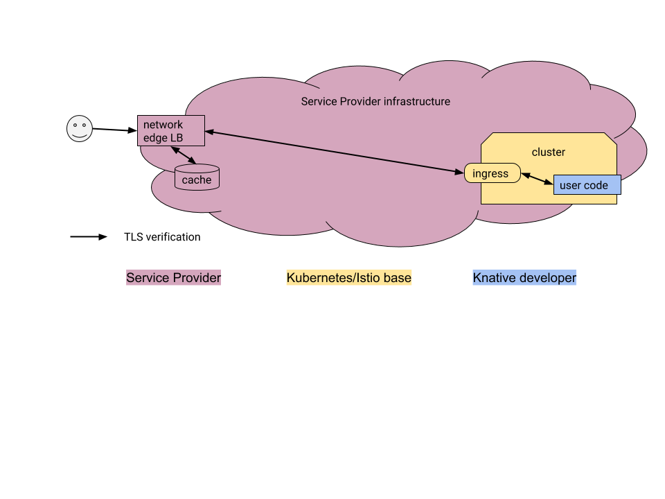

# Desired Knative SSL behavior

Desired features of a load balancing and SSL termination solution for Knative

1. Point-to-point encrypted path (possibly with several TCP + TLS hops)
1. Supports HTTP1 and HTTP2 framing
1. Support for HTTP caching and CDN
1. Support for management via API
1. Quick provisioning (<30s to create or enable a new domain name)
1. Support for both manual and automatic certificate provisioning

