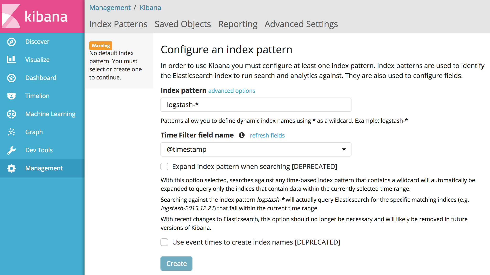
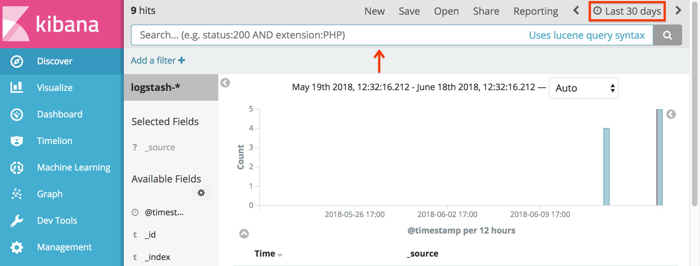

# Logs and metrics

## Monitoring components setup

First, deploy monitoring components.

### Elasticsearch, Kibana, Prometheus, and Grafana Setup

You can use two different setups:

1. **150-elasticsearch-prod**: This configuration collects logs & metrics from
user containers, build controller and Istio requests.

	```shell
	kubectl apply -R -f config/monitoring/100-common \
	    -f config/monitoring/150-elasticsearch-prod \
	    -f third_party/config/monitoring/common \
	    -f third_party/config/monitoring/elasticsearch \
	    -f config/monitoring/200-common \
	    -f config/monitoring/200-common/100-istio.yaml
	```

1. **150-elasticsearch-dev**: This configuration collects everything **150
-elasticsearch-prod** does, plus Knative Serving controller logs.

	```shell
	kubectl apply -R -f config/monitoring/100-common \
	    -f config/monitoring/150-elasticsearch-dev \
	    -f third_party/config/monitoring/common \
	    -f third_party/config/monitoring/elasticsearch \
	    -f config/monitoring/200-common \
	    -f config/monitoring/200-common/100-istio.yaml
	```

### Stackdriver, Prometheus, and Grafana Setup

If your Knative Serving is not built on a Google Cloud Platform based cluster,
or you want to send logs to another GCP project, you need to build your own
Fluentd image and modify the configuration first. See

1. [Fluentd image on Knative Serving](/image/fluentd/README.md)
2. [Setting up a logging plugin](setting-up-a-logging-plugin.md)

Then you can use two different setups:

1. **150-stackdriver-prod**: This configuration collects logs and metrics from
user containers, build controller, and Istio requests.

```shell
kubectl apply -R -f config/monitoring/100-common \
    -f config/monitoring/150-stackdriver-prod \
    -f third_party/config/monitoring/common \
    -f config/monitoring/200-common \
    -f config/monitoring/200-common/100-istio.yaml
```

2. **150-stackdriver-dev**: This configuration collects everything **150
-stackdriver-prod** does, plus Knative Serving controller logs.

```shell
kubectl apply -R -f config/monitoring/100-common \
    -f config/monitoring/150-stackdriver-dev \
    -f third_party/config/monitoring/common \
    -f config/monitoring/200-common \
    -f config/monitoring/200-common/100-istio.yaml
```

## Accessing logs

### Kibana and Elasticsearch

To open the Kibana UI (the visualization tool for [Elasticsearch](https://info.elastic.co),
enter the following command:

```shell
kubectl proxy
```

This starts a local proxy of Kibana on port 8001. The Kibana UI is only exposed within
the cluster for security reasons.

Navigate to the [Kibana UI](http://localhost:8001/api/v1/namespaces/monitoring/services/kibana-logging/proxy/app/kibana)
(*It might take a couple of minutes for the proxy to work*).

When Kibana is opened the first time, it will ask you to create an index.
Accept the default options:



The Discover tab of the Kibana UI looks like this:



You can change the time frame of logs Kibana displays in the upper right corner
of the screen. The main search bar is across the top of the Dicover page.

As more logs are ingested, new fields will be discovered. To have them indexed,
go to Management > Index Patterns > Refresh button (on top right) > Refresh
fields.

<!-- TODO: create a video walkthrough of the Kibana UI -->

#### Accessing configuration and revision logs

To access the logs for a configuration, enter the following search query in Kibana:

```
kubernetes.labels.knative_dev\/configuration: "configuration-example"
```

Replace `configuration-example` with your configuration's name. Enter the following
command to get your configuration's name:

```shell
kubectl get configurations
```

To access logs for a revision, enter the following search query in Kibana:

```
kubernetes.labels.knative_dev\/revision: "configuration-example-00001"
```

Replace `configuration-example-00001` with your revision's name.

#### Accessing build logs

To access the logs for a build, enter the following search query in Kibana:

```
kubernetes.labels.build\-name: "test-build"
```

Replace `test-build` with your build's name. The build name is specified in the `.yaml` file as follows:

```yaml
apiVersion: build.knative.dev/v1alpha1
kind: Build
metadata:
  name: test-build
```

### Stackdriver

Go to the [Google Cloud Console logging page](https://console.cloud.google.com/logs/viewer) for
your GCP project which stores your logs via Stackdriver.

## Accessing metrics

Enter:

```shell
kubectl port-forward -n monitoring $(kubectl get pods -n monitoring --selector=app=grafana --output=jsonpath="{.items..metadata.name}") 3000
```

Then open the Grafana UI at [http://localhost:3000](http://localhost:3000). The following dashboards are
pre-installed with Knative Serving:

* **Revision HTTP Requests:** HTTP request count, latency and size metrics per revision and per configuration
* **Nodes:** CPU, memory, network and disk metrics at node level
* **Pods:** CPU, memory and network metrics at pod level
* **Deployment:** CPU, memory and network metrics aggregated at deployment level
* **Istio, Mixer and Pilot:** Detailed Istio mesh, Mixer and Pilot metrics
* **Kubernetes:** Dashboards giving insights into cluster health, deployments and capacity usage

### Accessing per request traces

Before you can view per request metrics, you'll need to create a new index pattern that will store
per request traces captured by Zipkin:

1. Start the Kibana UI serving on local port 8001 by entering the following command:

	```shell
	kubectl proxy
	```

1. Open the [Kibana UI](http://localhost:8001/api/v1/namespaces/monitoring/services/kibana-logging/proxy/app/kibana).

1. Navigate to Management -> Index Patterns -> Create Index Pattern.

1. Enter `zipkin*` in the "Index pattern" text field.

1. Click **Create**.

After you've created the Zipkin index pattern, open the
[Zipkin UI](http://localhost:8001/api/v1/namespaces/istio-system/services/zipkin:9411/proxy/zipkin/).
Click on "Find Traces" to see the latest traces. You can search for a trace ID
or look at traces of a specific application. Click on a trace to see a detailed
view of a specific call.

To see a demo of distributed tracing, deploy the
[Telemetry sample](../sample/telemetrysample/README.md), send some traffic to it,
then explore the traces it generates from Zipkin UI.

<!--TODO: Consider adding a video here. -->

## Default metrics

The following metrics are collected by default:
* Knative Serving controller metrics
* Istio metrics (mixer, envoy and pilot)
* Node and pod metrics

There are several other collectors that are pre-configured but not enabled.
To see the full list, browse to config/monitoring/prometheus-exporter
and config/monitoring/prometheus-servicemonitor folders and deploy them
using `kubectl apply -f`.

## Default logs

Deployment above enables collection of the following logs:

* stdout & stderr from all user-container
* stdout & stderr from build-controller

To enable log collection from other containers and destinations, see
[setting up a logging plugin](setting-up-a-logging-plugin.md).

## Metrics troubleshooting

You can use the Prometheus web UI to troubleshoot publishing and service
discovery issues for metrics. To access to the web UI, forward the Prometheus
server to your machine:

```shell
kubectl port-forward -n monitoring $(kubectl get pods -n monitoring --selector=app=prometheus --output=jsonpath="{.items[0].metadata.name}") 9090
```

Then browse to http://localhost:9090 to access the UI.

* To see the targets that are being scraped, go to Status -> Targets
* To see what Prometheus service discovery is picking up vs. dropping, go to Status -> Service Discovery

## Generating metrics

If you want to send metrics from your controller, follow the steps below. These
steps are already applied to autoscaler and controller. For those controllers,
simply add your new metric definitions to the `view`, create new `tag.Key`s if
necessary and instrument your code as described in step 3.

In the example below, we will setup the service to host the metrics and
instrument a sample 'Gauge' type metric using the setup.

1. First, go through [OpenCensus Go Documentation](https://godoc.org/go.opencensus.io).
2. Add the following to your application startup:

```go
import (
	"net/http"
	"time"

	"go.opencensus.io/stats"
	"go.opencensus.io/stats/view"
	"go.opencensus.io/tag"
)

var (
	desiredPodCountM *stats.Int64Measure
	namespaceTagKey  tag.Key
	revisionTagKey   tag.Key
)

func main() {
	exporter, err := prometheus.NewExporter(prometheus.Options{Namespace: "{your metrics namespace (eg: autoscaler)}"})
	if err != nil {
		glog.Fatal(err)
	}
	view.RegisterExporter(exporter)
	view.SetReportingPeriod(10 * time.Second)

	// Create a sample gauge
	var r = &Reporter{}
	desiredPodCountM = stats.Int64(
		"desired_pod_count",
		"Number of pods autoscaler wants to allocate",
		stats.UnitNone)

	// Tag the statistics with namespace and revision labels
	var err error
	namespaceTagKey, err = tag.NewKey("namespace")
	if err != nil {
		// Error handling
	}
	revisionTagKey, err = tag.NewKey("revision")
	if err != nil {
		// Error handling
	}

	// Create view to see our measurement.
	err = view.Register(
		&view.View{
			Description: "Number of pods autoscaler wants to allocate",
			Measure:     r.measurements[DesiredPodCountM],
			Aggregation: view.LastValue(),
			TagKeys:     []tag.Key{namespaceTagKey, configTagKey, revisionTagKey},
		},
	)
	if err != nil {
		// Error handling
	}

	// Start the endpoint for Prometheus scraping
	mux := http.NewServeMux()
	mux.Handle("/metrics", exporter)
	http.ListenAndServe(":8080", mux)
}
```

3. In your code where you want to instrument, set the counter with the
appropriate label values - example:

```go
ctx := context.TODO()
tag.New(
    ctx,
    tag.Insert(namespaceTagKey, namespace),
    tag.Insert(revisionTagKey, revision))
stats.Record(ctx, desiredPodCountM.M({Measurement Value}))
```

4. Add the following to scape config file located at
config/monitoring/200-common/300-prometheus/100-scrape-config.yaml:

```yaml
- job_name: <YOUR SERVICE NAME>
    kubernetes_sd_configs:
    - role: endpoints
    relabel_configs:
    # Scrape only the the targets matching the following metadata
    - source_labels: [__meta_kubernetes_namespace, __meta_kubernetes_service_label_app, __meta_kubernetes_endpoint_port_name]
    action: keep
    regex: {SERVICE NAMESPACE};{APP LABEL};{PORT NAME}
    # Rename metadata labels to be reader friendly
    - source_labels: [__meta_kubernetes_namespace]
    action: replace
    regex: (.*)
    target_label: namespace
    replacement: $1
    - source_labels: [__meta_kubernetes_pod_name]
    action: replace
    regex: (.*)
    target_label: pod
    replacement: $1
    - source_labels: [__meta_kubernetes_service_name]
    action: replace
    regex: (.*)
    target_label: service
    replacement: $1
```

5. Redeploy prometheus and its configuration:
```sh
kubectl delete -f config/monitoring/200-common/300-prometheus
kubectl apply -f config/monitoring/200-common/300-prometheus
```

6. Add a dashboard for your metrics - you can see examples of it under
config/grafana/dashboard-definition folder. An easy way to generate JSON
definitions is to use Grafana UI (make sure to login with as admin user) and
[export JSON](http://docs.grafana.org/reference/export_import) from it.

7. Validate the metrics flow either by Grafana UI or Prometheus UI (see
Troubleshooting section above to enable Prometheus UI)

## Distributed tracing with Zipkin
Check [Telemetry sample](../sample/telemetrysample/README.md) as an example usage of
[OpenZipkin](https://zipkin.io/pages/existing_instrumentations)'s Go client library.

## Delete monitoring components
Enter:

```shell
ko delete --ignore-not-found=true \
  -f config/monitoring/200-common/100-istio.yaml \
  -f config/monitoring/200-common/100-zipkin.yaml \
  -f config/monitoring/100-common
```
