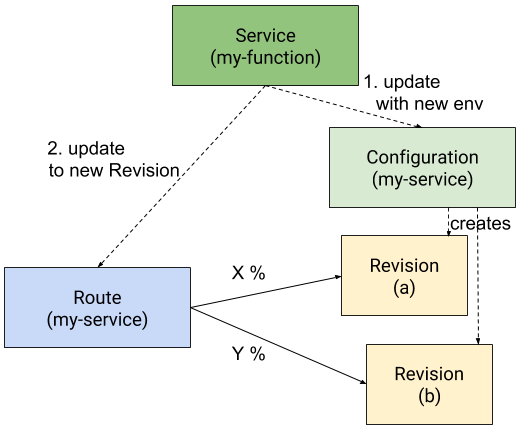
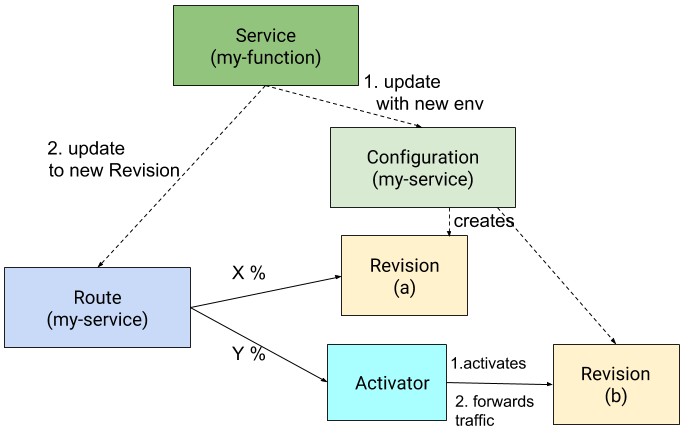

# The Activator Network Configurations

## Traffic configuration overview

An ingress object is created per Route to direct external traffic to reach desired revisions. This ingress
object has annotations "istio" so Istio is the ingress controller which fulfills the ingress. The ingress
uses domain based routing to map the requests to the placeholder service. The placeholder service is then
mapped to Istio routerules which control traffic across revisions and the activator service.

The picture below shows traffic configuration for a route "abc-route".

## Istio Route Rules Configurations

Knative Serving Route objects control traffic split via Istio route rules. When a revision is in Reserve state
due to inactivity, instead of letting the revision get traffic assignment directly, Route defines route
rules such that the activator gets the portion of traffic for the revision. Below are detailed description
for three cases.

### All revisions are active

When all revisions are active, the activator service does not get any traffic.
Below is an example where the route (my-service) has two traffic targets, Revision a and Revision b, and
both revisions are active. Note activator does not serve traffic.

### One revision is in Reserve state

When one revision is in Reserve state, the activator services gets its traffic assignment.
Below is an example where Revision a is active and Revision b is in Reserve. In this case, the Activator
gets traffic assignment for Revision b. Upon receiving requests, Activator activates Revision b and
forwards requests to Revision b after it is ready. After the revision is activated and ready to serve
traffic, the Revision b gets assigned portion of traffic directly.

### Multiple revisions are in Reserve state

When there are two or more revisions are in Reserve state, the Activator service gets traffic for all
Reserve revisions. Among Reserve revisions, Activator activates the revision with the largest traffic
weight, and forwards traffic to it. There is room for improvement for this behavior ([#882](https://github.com/knative/serving/issues/882)).
After the revision is activated and ready to serve traffic, activator gets the portion of traffic
for all the rest Reserve revisions.