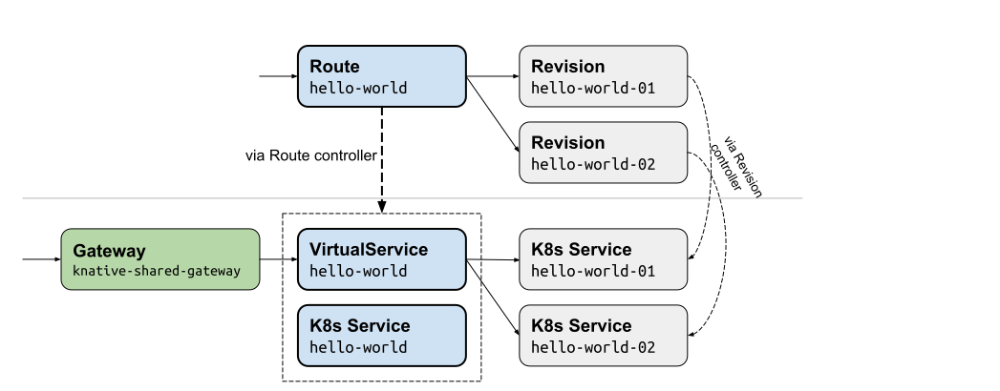
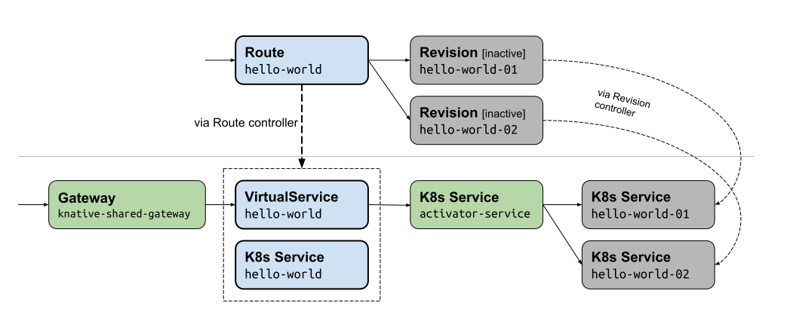

### Route CRDs

All routing in Knative Serving is done through the Route CRD, which provides a
network endpoint for a user's service/app (which consists of a series of
software and configuration Revisions over time). The Route provides a
long-lived, stable, named, HTTP-addressable endpoint that is backed by one or
more
[Revisions](https://github.com/knative/serving/blob/master/docs/spec/overview.md#revision).
The default configuration is for the `Route` to automatically direct traffic to
the latest revision created by a Configuration. For more about Routes, read
[this doc](https://github.com/knative/serving/blob/master/docs/spec/overview.md#route).

Currently we use Istio to program the network for Routes, but we don't exclude
other implementations if they can provide similar functionality.

### Underlying implementation using Istio

#### Shared Gateway for all Knative Routes

Currently all Routes can receive external traffic through a shared Istio
Gateway. Many of our users may already be Istio users. In order to avoid
conflict with users' Gateway settings, we use a different Gateway than the
default `istio-ingressgateway`. In the future we should probably provide a way
for the users to select what the Gateway they use -- and how Knative would
expect such Gateway to look like.

#### For each Route, a VirtualService and Service

A valid Route object, when reconciled by Knative Route controller, will generate
the following objects:

- A VirtualService to realize the routing from the Gateway
  `knative-ingress-gateway` to the traffic target referenced in the Route.
- A Service with the same name as the Route, so that we can access the Route
  using `<route-name>.<route-namespace>.svc.<cluster-domain-name>`. This Service
  has no Pod, we use it solely to have a domain name and a cluster IP to be used
  in the VirtualService. The value of `<cluster-domain-name>` depends on a
  domain name specified during the installation of the cluster. If no custom
  domain name was specified, then `cluster.local` should be used as in the
  following example:

  `<route-name>.<route-namespace>.svc.cluster.local`

  otherwise cluster's custom domain name should be used:

  `<route-name>.<route-namespace>.svc.real-domain-name.com`

For example, if we have two Knative Revisions `hello-world-01` and
`hello-world-02`, and one Route `hello-world` that directs traffic to both
Revisions, the resources would look like:

#### Routing in the presence of Inactive Revisions (aka 0→1)

In the case of inactive Revisions, a Route would direct requests through the
Service `activator-service`, with enough information in the headers so that the
Service `activator-service` Service can activate a Revision before relaying the
traffic to it.

From the same scenario of the previous example, if the Revision `hello-world-01`
becomes inactive due to lack of traffic, the resources would look like:

Note that while we still see a `hello-world-01` Service in this case, it does
not have any Pod until activated by the activator.

After Revision `hello-world-02` also becomes inactive due to lack of traffic,
the resources would look like:

If any activation happens, Revisions becomes active again and traffic will be
adjusted to route directly to the Revision, without going through the Service
`activator-service`.
