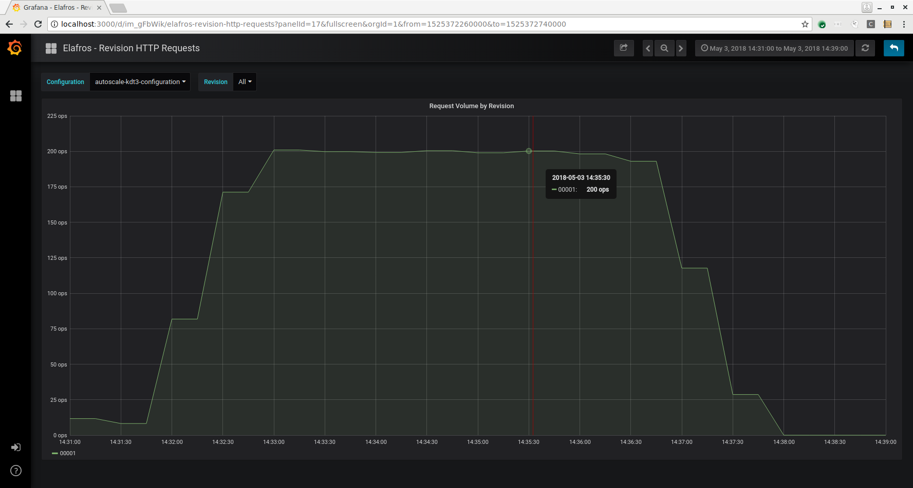
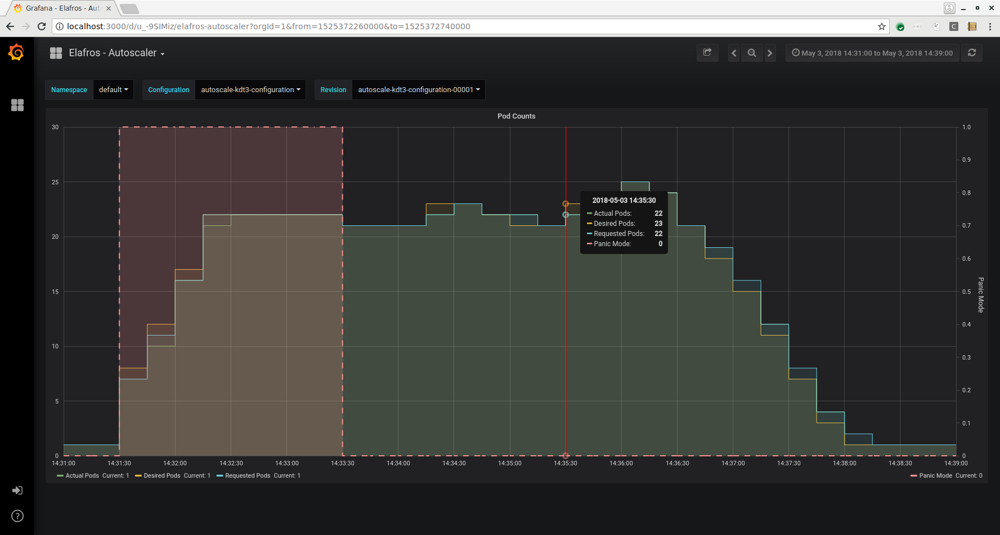
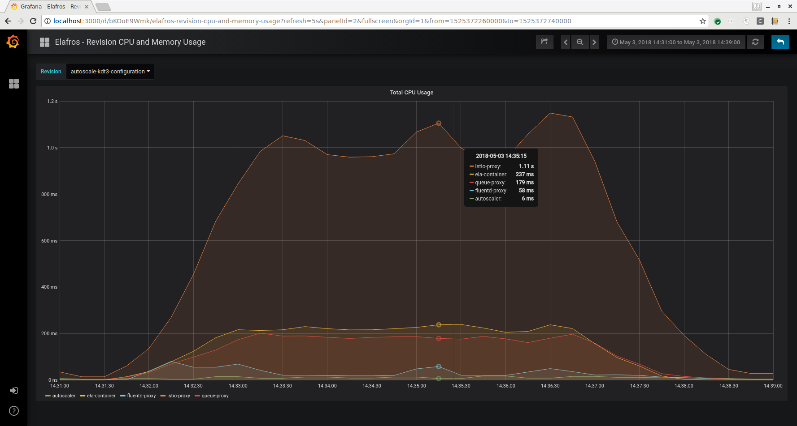
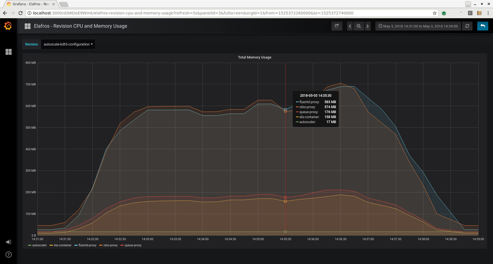
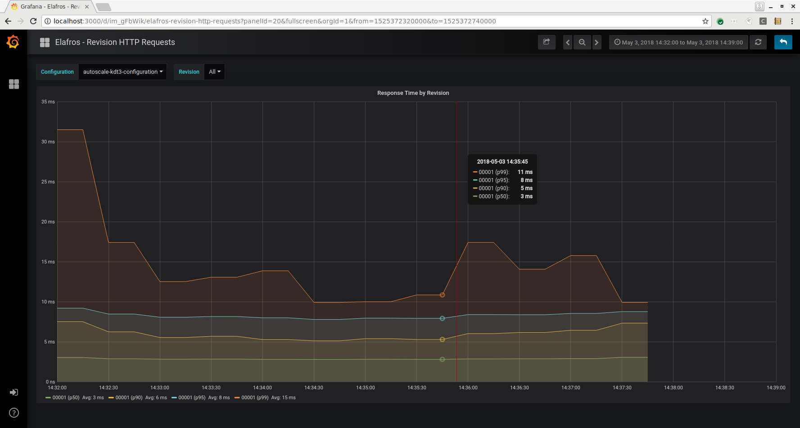
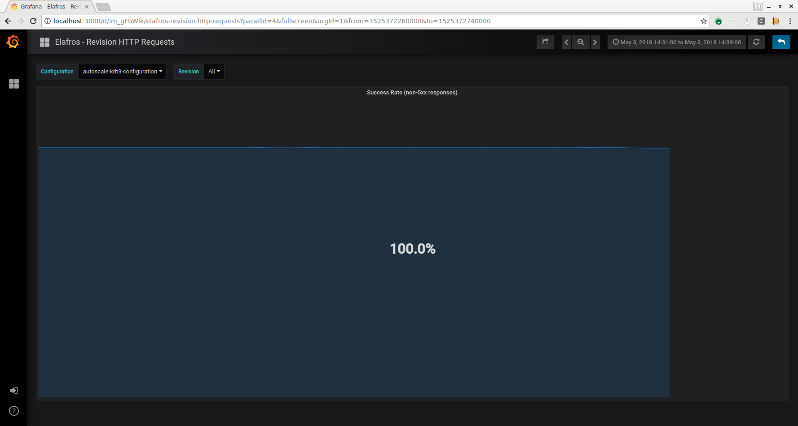

# Autoscale Sample

A demonstration of the autoscaling capabilities of an Elafros Revision.

## Prerequisites

1. [Setup your development environment](../../DEVELOPMENT.md#getting-started)
2. [Start Elafros](../../README.md#start-elafros)
3. [Setup telemetry](../../docs/telemetry.md)

## Setup

Deploy a simple 3D tic-tac-toe webapp.

```shell
bazel run //sample/autoscale/kdt3:everything.create
istioctl create -f sample/autoscale/kdt3/egress.yaml
```

Export `SERVICE_HOST` and `INGRESS_IP`.

```shell
export SERVICE_HOST=`kubectl get route autoscale-kdt3-route -o jsonpath="{.status.domain}"`
export SERVICE_IP=`kubectl get ingress autoscale-kdt3-route-ela-ingress -o jsonpath="{.status.loadBalancer.ingress[*]['ip']}"`
echo SERVICE_HOST=${SERVICE_HOST?} SERVICE_IP=${SERVICE_IP?}
```

Verify the app is running.

```shell
time curl -I -s --header "Host:${SERVICE_HOST?}" http://${SERVICE_IP?}/game/
```

## Running a QPS load test

Ramp up over 1 minute to 100 queries-per-second (qps) for 10 minutes.

```shell
QPS=200
RAMP_TIME_SECONDS=60
TEST_TIME_MINUTES=5
kubectl create namespace wrk
for i in `seq 10 10 $QPS`; do
  kubectl run wrk-$i \
    --image josephburnett/wrk2:latest \
    --restart Never --image-pull-policy=Always -n wrk \
    -- -c10 -t10 -d${TEST_TIME_MINUTES}m -R10 \
       -H "Host: ${SERVICE_HOST?}" \
       "http://${SERVICE_IP?}/game/"
  sleep $(( $RAMP_TIME_SECONDS / ($QPS / 10) ))
done
```

Watch the Elafros deployment pod count increase.  Then return to 1.

```shell
watch kubectl get deploy
```

## Analysis

Connect to Grafana as described in [the telemetry instructions](../../docs/telemetry.md).  You should see something like this:

### QPS Load



### Autoscaling



### CPU Usage



### Memory Usage



### Latency



### Success Rate



## Other test scenarios

Slower rampup:

```shell
QPS=200
RAMP_TIME_SECONDS=400
```

Lower peak:

```shell
QPS=50
RAMP_TIME_SECONDS=60
```

Ludicrous mode:

```shell
QPS=1000
RAMP_TIME_SECONDS=30
```

Cpu heavy app:

```shell
bazel run //sample/autoscale/prime:everything.create

```
```shell
export SERVICE_HOST=`kubectl get route autoscale-prime-route -o jsonpath="{.status.domain}"`
export SERVICE_IP=`kubectl get ingress autoscale-prime-route-ela-ingress -o jsonpath="{.status.loadBalancer.ingress[*]['ip']}"`
echo SERVICE_HOST=${SERVICE_HOST?} SERVICE_IP=${SERVICE_IP?}
time curl -I -s --header "Host:${SERVICE_HOST}" http://${SERVICE_IP?}/primes/40000
```

Batch job:

```shell
batch () {
  for i in `seq 1 1000`
  do
    sleep 0.02
    curl -s -o /dev/null -w "%{http_code}\n" \
      --header "Host:${SERVICE_HOST?}" \
      http://${SERVICE_IP?}/primes/40000000 &
  done
  wait
}
time batch 2>/dev/null | sort | uniq -c
```

## Cleanup

```shell
kubectl delete namespace wrk
istioctl delete -f sample/autoscale/kdt3/egress.yaml
bazel run sample/autoscale/kdt3:everything.delete
bazel run sample/autoscale/prime:everything.delete
```

## References

This load test uses a modified version of `wrk2`.  Source code is [here](https://github.com/josephburnett/wrk2) and can be run directly from the [Dockerhub repo](https://hub.docker.com/r/josephburnett/wrk2/).
